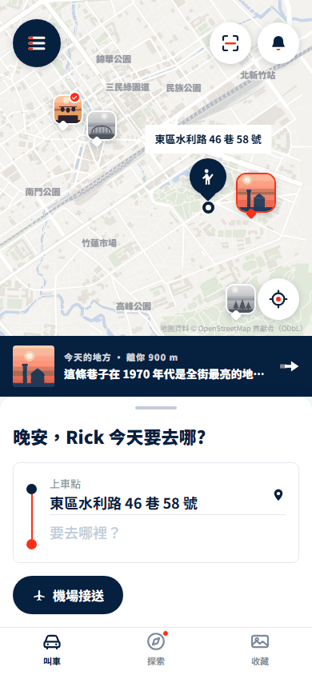
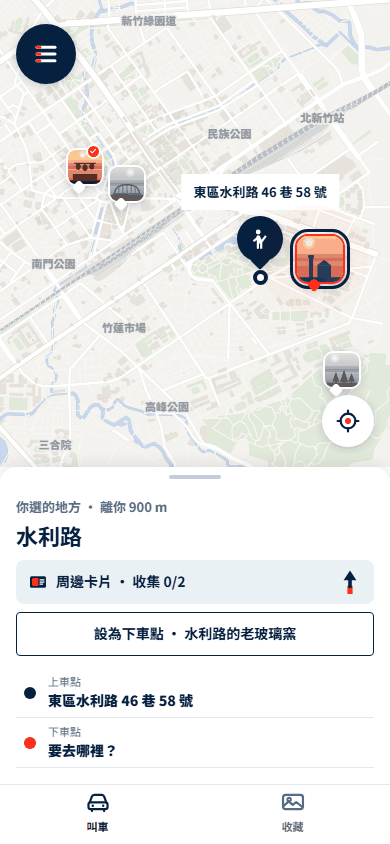
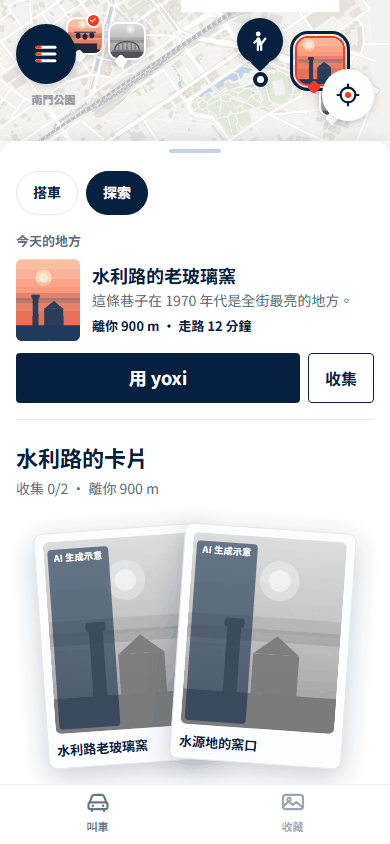

# yoxi 城事 — web app（雙主頁 UI 第一版）

  

`prototype/` 是 102 張各自獨立的設計原型；`app/` 現在以**叫車／收藏兩個主頁**呈現第一版重新設計：
hash 路由、狀態存在 localStorage、可安裝成 PWA。原型一個字沒動，app 只從 `../prototype` 讀共用的樣式、假資料與地圖。

> 不用安裝任何東西。把 `app/index.html` 拖進 Chrome 就能用；全部離線。

契約（API、DOM、測試、分工）在 [`ARCHITECTURE.md`](ARCHITECTURE.md)；測試手冊在 [`tests/README.md`](tests/README.md)。

## 怎麼開

| 在哪 | 怎麼做 | 看到什麼 |
|---|---|---|
| 桌機 | 把 `app/index.html` 拖進 Chrome | 手機外框（390×844）＋右邊一條 demo 工具面板 |
| 手機 | 桌機跑 `python app/tools/serve.py`，手機連同一個 Wi-Fi，開它印出來的「區網」網址 | 滿版，沒有外框；demo 工具在「設定 → demo 工具與關於」 |
| 裝到主畫面 | 只有 `localhost` 或 https 才註冊 service worker，才能「加到主畫面」 | 區網的 http 網址能用、不能裝；要裝就放上任何 https 靜態主機 |

- `file://` 下 service worker 會安靜略過，不影響使用。
- 第一次開會先看三張 onboarding（可略過）；想重來按 demo 工具的「重設 demo」。

## 這版怎麼看

設計決策與接手路徑見 [`docs/HANDOFF.md` §13](../docs/HANDOFF.md#13-2026-09-24-雙主頁與探索卡片面板目前-app-主畫面)；使用者提供的版面參考和逐輪回饋圖見 [`docs/references/`](../docs/references/README.md)。

- 底欄維持「叫車」與「收藏」。叫車頁預設是一般搭車畫面；面板頂端按變體 F 的兩顆 pill 切換「搭車／探索」。搭車面板往下拉時跟手收合，點「展開搭車」平順恢復。探索切換後預選最近地點，底部顯示簡短資訊與「用 yoxi／收集」；上拉或點「收集」時保留這塊地點資訊，下面接著顯示疊放的可收集卡片，不另設附近地區清單。點地圖圖釘切換地區，點卡片會出現可翻面的[懸浮小卡](assets/shots/ride-float.png)。探索下拉只收合面板，仍留在探索；點「用 yoxi」回搭車頁並填好下車點。
- 收藏首頁是摘要式排版：明信片主卡、去過的地方與公里數、明信片網格和獎章。數字跟著既有狀態改變。
- `#/ride?mode=explore&area=moat` 可直接打開探索的選定地點。舊探索、地點詳情和回顧路由仍可用於舊流程對照，但不在新底欄。

## 原合一版的資料與流程

照 `prototype/proposal.html` 決策矩陣的推薦；原本未定的軸線在這裡拍板（完整版見 `ARCHITECTURE.md` §0）。

| 軸線 | 選 | 在 app 裡長什麼樣 |
|---|---|---|
| 入口 | 雙主頁底欄 | 叫車／收藏；舊探索路由保留作對照 |
| 地圖歸誰 | F＋E 同頁切模式 | 叫車首頁是真實新竹地圖；搭車不顯示景點，探索最多 4 個景點，可設為下車點 |
| 轉換點 | K1 內容頁 | 地方詳情 ≤ 3 km 主「走路前往」、次「設為下車點」；走不到就對調 |
| 收藏組織 | 摘要式首頁 | 主卡、統計卡、明信片與獎章網格 |
| 獎章呈現 | X4 勳章牆 | 沒有進度環、沒有集點卡；寫「收集 4/8」 |
| 探索敘事 | X2 缺口導向 | 「今天的地方」大卡＋「你還沒有 ○○ 類」 |
| 認知負擔 | L1 一屏一事 | 可按數 ≤ 10；探索與收藏兩個索引頁 ≤ 12 |
| 儀式 | 三幕解鎖 | 灰點爆開上色 → AI 生成中 → 成品；點畫面跳到成品 |
| 家人 | 分享選項 | 分享面板第一格是長輩圖；沒有家人模式 |
| 好康任務 | 不同頁 | 不合併 |
| 好友 | 不做 | 五個未決還在 |

## 舊版流程對照

以下流程仍可透過舊路由試走，用來檢查叫車、收卡與回顧資料。新版主畫面的兩個入口與上拉操作見上方「這版怎麼看」。

**A 不搭車的日常**（推播早 → 探索 → 地方 → 前往 → 解鎖 → 收藏）

1. demo 工具按「早上推播」，點浮層上的推播 → 叫車頁選定今天的地方，上拉可看周邊卡片；要對照原本的內容流程，可直接開 `#/explore`。
2. 看「今天的地方」大卡與下面的缺口區塊，按大卡的「先看看這是什麼地方」進地方詳情。
3. 距離 ≤ 3 km，主要按鈕是「走路前往」→ 前往中（這一頁刻意什麼都不做）。
4. demo 工具按「模擬抵達」→ 三幕解鎖；點畫面可直接跳到成品。
5. 按「收進收藏」→ 收藏頁，新卡在書架上。

**B 搭車的轉換**（路線 → 內灣 → 設為下車點 → 叫車 → 行程 → 評分 → 限定版 → 點數）

1. 直接開 `#/routes` →「沿著鐵道走：內灣線的六個站」。
2. 內灣老街是「腳到不了的一段」（28 公里），按「設為下車點 · 約 $…」→ 回叫車首頁，叫車鈕就緒、車資是公式算的。
3. 按叫車 → 配對中約 1 秒後轉行程中，看「這條路上」內容卡。
4. 按「模擬抵達」（頁上或 demo 工具）→ 行程結束頁；先評分，金色橫幅才出現。按「回首頁」也不會丟：叫車首頁會多一列金色入口。
5. 點金色橫幅 → 金框限定版三幕解鎖 → 收進收藏。
6. 抽屜 → 和泰 Points：多了 50 點，總數＝明細相加。

**C 晚上的回顧**（推播晚 → 回顧 → 日誌 → 週回顧 → 長輩圖）

1. demo 工具按「晚上推播」，點推播 → 一天的回顧四幕（只有你看得到）。
2. 前兩幕按「下一步」，第三幕點一張照片或「跳過」，最後一幕選心情（或「先不選」）→ 回到收藏首頁。
3. 私密回顧沒有分享鍵；舊版週回顧可從 `#/week` 直接開啟，右上可分享。
4. 分享面板第一格「傳給家人」→ 長輩圖。

推播一天最多兩則，早晚各一；「模擬抵達」只在前往中或行程中能按。

demo 前的提醒：先按「重設 demo」讓數字跟講稿一致；投影用 1080p 或瀏覽器全螢幕（F11），1280×720 時手機外框會縮到約 0.8 倍，後排字會小；限定版與 +50 點只給走不到（> 3 km）的地方。五種講法的講稿在 `../docs/narratives/`。

## 畫面地圖

25 條 route（`/` 導到 `/ride`，第一次開先到 `/welcome`；其餘 path 是 404）。來源原型都在 `prototype/screens/`。

| path | 畫面 | 來源原型 |
|---|---|---|
| `/welcome` | onboarding 三張 | 新 |
| `/ride` | 預設搭車；面板內切探索後預選最近地區，上拉看卡片堆（`?mode=explore&area=` 可選地區） | 沿用原叫車 sheet 與地圖資料，參考變體 F 的面板切換 |
| `/dropoff`、`/pickup` | 下車地點（清單＋搜尋）、上車地點 | 新（參考 `pickup`）、`pickup` |
| `/trip`、`/trip/done` | 配對中→行程中；行程結束頁＋評分＋金色橫幅 | `ride`、`ride-done` |
| `/drawer`、`/points`、`/notify`、`/trips` | 抽屜、和泰 Points、通知、行程紀錄 | `drawer`、`points`、`notify`、`trips` |
| `/explore` | 探索（X2＋今天的地方） | `variant-x2-explore`、`explore`、`variant-l1-explore` |
| `/explore/map` | 探索地圖（≤ 10 景點） | `map`、`concept-map-explore` |
| `/place/:id` | 地方詳情（K1） | `variant-k1-place`、`place` |
| `/going/:id`、`/unlock/:id` | 前往中；三幕解鎖（`?ride=1` 金框） | `going`、`unlock` |
| `/routes`、`/route/:id` | 路線列表；路線詳情（斷點可設為下車點） | `routes`；`route`、`variant-k4-route` |
| `/album` | 收藏摘要（主卡＋統計＋明信片與獎章） | 參考原收藏資料與 Apple 健身摘要排版 |
| `/postcard/:id`、`/badge/:id` | 明信片（翻面）、獎章 | `postcard`、`badge` |
| `/footprint` | 城市足跡（霧、覆蓋率算出來） | `fogmap`、`concept-map-footprint` |
| `/lookback`、`/week`、`/elder` | 一天的回顧四幕、週回顧、長輩圖 | `lookback`、`week`、`elder` |
| `/settings` | 城事設定（隱私、重設、demo 工具） | `settings` |

## 怎麼測（需要 Python 3、node 18+、Chrome 或 Edge）

```bash
python app/tests/run.py              # 全部：node 單元測試 → headless Chrome；非零 exit＝有 FAIL
python app/tests/run.py --only ride  # 只跑一個 spec（逗號分隔可多個：system,ride,explore,album,app）
python app/tests/run.py --unit       # 只跑 node 單元測試（router、fmt、store）
python app/tools/check-sw.py         # sw.js 的快取清單與實際檔案對帳
python app/tools/shoot-app.py        # 每條 route 用手機寬度拍一張（app/assets/shots/），另拼一張 board.png
```

目前瀏覽器測試 189 條（app 43、system 20、ride 27、explore 37、album 15、flows 47）＋node 單元測試 34 條，全綠。測的東西：

| 測什麼 | 怎麼量 |
|---|---|
| 每條 route 都 render | 不丟例外、`main.view[data-view]` 在、沒有「尚未建檔」卡 |
| 死按鈕 | 每個 `a`／`button` 都要有 href（已註冊的 route）、`onclick` 或 `data-toast` 等 |
| 禁用詞 | 掃算繪後的文字與 `title`／`aria-label`／`placeholder` |
| 可按數 | 一般畫面 ≤ 10，`/explore`、`/album` ≤ 12（量法同 `prototype/tools/audit-load.html`） |
| 公式數字 | 車資、分鐘、距離、收集 n/m、點數＝明細相加、覆蓋率 |
| 三條流程端到端 | A／B／C 從推播或路線一路點到收藏、點數、長輩圖 |
| 其他 | 返回鍵回到來處、狀態持久化、CSS 沒有 hex、首屏 3 秒內 |

## 怎麼改

加一個畫面：

1. 在對應區塊的檔（`js/views/{ride,explore,album,system}.js`）用 `APP.view('名字', { path, tab, render, mount })` 註冊；檔頭補「回答什麼／從哪張原型來／刻意沒有的東西」。
2. 樣式寫在同區塊的 `css/views/X.css`，只用 `tokens.css` 的變數，不寫 hex。
3. 在 `tests/specs/X.spec.js` 加 spec：render、死按鈕、禁用詞、可按數、數字對公式、返回鍵。
4. 新增檔案要加進 `sw.js` 的 `PRECACHE`、`VERSION` 加一，跑 `python app/tools/check-sw.py`。
5. `python app/tests/run.py` 全綠。

按鈕一律 `element.onclick`＋`data-act="動詞-名詞"`；數字一律走 `APP.fmt`／`STATE`／`MOCK`。API 與規矩全在 `ARCHITECTURE.md`，改契約先改那份。

## 已知限制

- **叫車、抵達、推播都是模擬的**：沒有真的派車；抵達靠行程中的按鈕或 demo 工具；推播是 app 內的浮層。
- **地圖只有新竹 11×12 km**（OSM 抓一次、離線）。內灣在 28 km 外，不在底圖範圍，行程與路線上的內灣會夾到地圖邊緣。
- **城市足跡少算八張卡**：22 張明信片裡有 8 張（合興、九讚頭、橫山、玻璃工藝博物館、春池玻璃、舊社的矽砂場、水源地的窯口、頭前溪河口）對不到地圖座標，收了也不進覆蓋率。
- **PWA 要 http(s)**：`file://` 能用不能裝；區網 http 也不能裝，要 localhost 或 https。
- 明信片與插圖是程式生成示意（標「AI 生成示意」）；實景照片只覆蓋十個地點。
- 狀態只存在這台瀏覽器的 localStorage，換裝置或清資料就重來。

## 授權

- 地圖資料 © OpenStreetMap 貢獻者，ODbL 1.0；每張地圖右下角有署名（hsmap 自帶，不要關）。
- 實景照片來自 Wikimedia Commons，作者與授權在 `prototype/assets/photos/credits.js`，也列在 app 的設定頁。
- Leaflet 沒有用在 app（只有原型的 `concept-map-tiles.html` 用）。app 不連網、不載 CDN、不用 webfont。
- 人物、地方故事、車資與時間是虛構或公式算出來的示意值。
