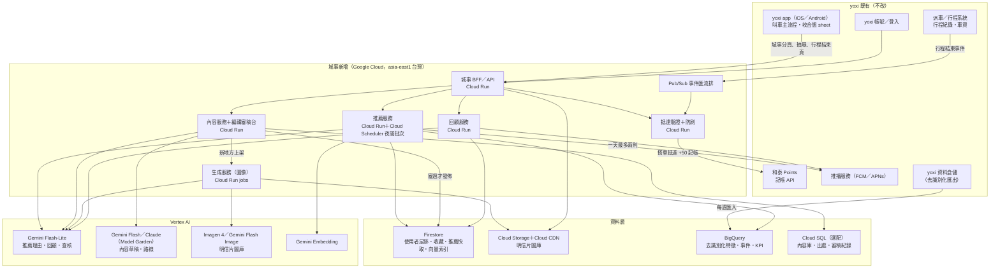

# yoxi 城事 — AI 應用方法、技術架構與成本試算（導入方案）

> **回答簡報哪幾頁**：第 4 章「AI 應用方法」（技術／工具／模型、AI 的關鍵角色、選用原因）；第 6 章「落地評估」的技術架構、運算資源、成本試算、導入時程；yoxi 題提案項目第 3 項「實作的技術架構」。
> **結論三句**：① AI 在城事做四件事：推薦「今天的地方」、地方內容草稿、明信片生成、回顧敘事。每一件都有「沒有 AI 也能跑」的退路，而且都不碰叫車主流程。② 雲端每月成本在 pilot（新竹 1 萬 MAU）約 US$522（NT$1.7 萬），擴到 6 都 20 萬 MAU 約 US$7,319，擴到全台 100 萬 MAU 約 US$34,836；每 MAU 每月 US$0.035–0.052（全部是用上限假設算的）。③ 「AI 成本相對小、瓶頸在編輯」三個規模都成立，但成立的理由不一樣。內容這一側（草稿加圖庫）一座城一個月約 US$74（NT$2,400），只佔一城內容人力（NT$8.65 萬）的 2.7%。會跟著使用者人數長的是「個人化文字」（推薦理由、回顧）：到 100 萬 MAU，全部 AI 費用在上限假設下已經是內容人力的 81%，所以每天的回顧要先用模板，LLM 後上。
> **內容量假設以 `business.md` §4 為準；雲端與 AI 成本以本文件 §4–§5 為準。**
> **還沒有答案的事**：yoxi 解題資料的實際欄位與粒度（決定推薦特徵能做到多細）；Gemini／Imagen 各模型在台灣區域（asia-east1）的實際可用清單；和泰集團對雲端與資料落地的內部規範；城市編輯的實際產能（每月能審幾個地方）；+50 點由誰出（見 `business.md`）。

查價日期：**2026-09-23**。Google Cloud 的 Vertex AI 現在的官方名稱是「Gemini Enterprise Agent Platform（formerly Vertex AI）」，定價頁標題是「Agent Platform Pricing」。本文件沿用 Vertex AI 這個大家比較熟的名字。
匯率：**1 USD = NT$32（假設，上線前用當月牌告匯率重算）**。金額都未稅。

---

## 1. AI 在方案裡的位置：四個角色，一個不是 AI 的轉換點

| # | AI 角色 | 使用者在哪裡看到 | 原型畫面（app route） | 沒有它會怎樣 |
|---|---|---|---|---|
| a | 個人化推薦「今天的地方」 | 早上推播、探索首頁大卡、「為什麼推薦給你」五條依據 | `/explore`、`/place/:id` | 退回每個人都看到同一個編輯精選；「附理由」的說服力消失 |
| b | 地方內容產線 | 地方詳情三段「現在的它／以前的它／為什麼是今天」、這個月的路線 | `/place/:id`、`/routes`、`/route/:id` | 新地方的單位工時從 2.5 小時回到 5 小時（`business.md` §4.3，假設），同一位編輯每月能上的新地方約減半；跨城擴張卡在人力 |
| c | 明信片／長輩圖生成 | 抵達解鎖三幕的第二幕「正在畫下今天的這裡」、收藏、長輩圖 | `/unlock/:id`、`/album`、`/elder` | 退回 CC 實景照片或程式生成的風格卡（原型現在的 `postcardArt`） |
| d | 回顧自動敘事 | 晚上推播、四幕回顧、日誌摘要、這一週 | `/week`、回顧流程 | 退回數字模板（「今天走了 4.3 km，經過 3 個地方」） |
| — | **轉換點「設為下車點」** | 地方詳情、路線斷點、叫車首頁景點小卡 | `/place/:id`、`/route/:id`、`/ride` | **這不是 AI。** 規則只有一條：距離超過 3 km（`APP.fmt.WALK_MAX_M`）就把主要按鈕換成「設為下車點」，車資用 `75 + 22 × km` 公式算。它是產品設計，簡報不寫成 AI。 |

**「AI 是關鍵、不是裝飾」怎麼成立**：拿掉 AI，城事還能跑（每個角色都有退路），但會退化成「一份編輯精選清單＋一本相簿」。這樣的東西沒有理由讓人每天打開，也沒辦法一座城一座城複製。AI 解決的是兩個規模問題：**個人化的規模**（每個人每天拿到不一樣、而且講得出理由的一個地方）和**內容的規模**（一位編輯管得動一整座城）。

---

## 2. 四個角色的規格表

### 2.1 (a) 個人化推薦「今天的地方」

| 項目 | 內容 |
|---|---|
| 輸入資料 | **yoxi 去識別化資料**（競賽解題資源）：叫車時段與頻率趨勢、乘車場域屬性（POI）、熱門上下車地點、交通樞紐與活動熱點。**使用者自己的**：常用上車點（只到網格，不存原始軌跡）、常用時段、收藏缺口（還沒有哪一類）、90 天內去過的地方。**外部**：天氣（中央氣象署開放資料）、地方公告（整修、活動期間）。 |
| 模型類型 | 分兩層。**排序層**：規則加輕量模型，包括候選過濾（距離、營業、天氣）、特徵加權分數，之後再換成梯度提升樹（BigQuery ML 的 boosted tree）；地方與使用者的相似度用向量索引（Gemini Embedding 加 Firestore 向量查詢）。**理由層**：Gemini Flash-Lite 把排序層吐出的特徵（例如「缺口：工業遺構」「週日下午在家」）寫成一句人話。 |
| 輸出 | 每人每天 1 個地方＋最多 5 條「為什麼推薦給你」（每條都標依據來源，對應原型 `MOCK.TODAY.why` 的 `src` 欄位）＋備選 2 個（使用者說「換一個」時用） |
| 人在哪裡介入 | 城市編輯決定**候選池**（只有審過、已上架的地方能被推薦）；產品設定**硬規則**（一天最多兩則推播、同一地點 14 天內不重推（假設）、封閉整修中的不推）。模型只負責排序和寫理由，不能自己加入候選。 |
| 失敗時的退路 | 排序層失敗：改推編輯本週精選，依離常用上車點的距離排。理由層失敗：用特徵模板組句（「你的收藏裡還沒有工業遺構類」）。**第 0 步完全不需要推薦模型。** |
| 為什麼非 AI 不可 | 「一天一個、附理由」要對每個人都成立：候選幾百個、特徵十幾種、每天要重排。規則寫得出排序，寫不出一句讀起來像城市在跟你說話的理由。理由是評審看得到「AI 有依據」的地方（`judge.md` 主張表：「五條理由很具體，但都是 MOCK 寫死的」）。 |
| 計算時機 | **夜間批次**：Cloud Scheduler 在 03:00 觸發，Batch／Flex 價格是即時的一半，結果寫進 Firestore；早上 8:10 推播只讀快取。天氣在 07:00 用規則覆寫一次（下雨就把戶外點換成備選）。 |

### 2.2 (b) 地方內容產線（AI 草稿 → 城市編輯審 → 有出處才上架）

| 項目 | 內容 |
|---|---|
| 輸入資料 | 公開來源：縣市政府與文化局活動公告、文化資產資料庫、OSM（地點座標與屬性）、Wikimedia Commons（照片與作者）；合作方供稿（在地店家、展覽）；yoxi 熱門上下車點與活動熱點（決定哪些地方值得先寫）。 |
| 模型類型 | **草稿**：中階多模態 LLM（Gemini 3.5 Flash；長文語氣可換 Model Garden 上的 Claude Sonnet 5，見 §4）＋ Grounding（接 Google 搜尋或自有文件庫），讓每一句都帶來源 URL。**查核**：Flash-Lite 做「每一句能不能指回來源」的逐句比對，指不回的句子標紅。**路線重組**：同一個中階模型，每月依活動公告把地方串成 3 條路線。 |
| 輸出 | 地方卡草稿：三段文字（現在的它／以前的它／為什麼是今天），每段附出處清單；小提醒（`tip`）；開放時間；分類標籤。路線草稿：站序＋一句副標。 |
| 人在哪裡介入 | **每一篇都要過城市編輯**：核對出處、改語氣、刪掉指不回來源的句子，按「上架」。**AI 沒有上架權限**：內容服務的上架 API 只接受編輯帳號簽核（IAM 角色分離）。虛構或示意的內容一律加標示（原型現在已經這樣做）。 |
| 失敗時的退路 | 編輯直接從公告與文獻手寫（原型的 22 張明信片文字就是這樣來的）；合作方供稿經過改寫直接上。退路的代價是產能，不是品質。 |
| 為什麼非 AI 不可 | 一座城開城要有 60 個地方的種子庫，之後每月新增 20 個、翻新 10 個，外加 1 條路線與 4 篇合作方稿件（`business.md` §4.2，假設）。沒有 AI 草稿時，一個新地方要 5 小時（查資料＋撰寫）；有草稿降到 2.5 小時，編輯只做查證與判斷（`business.md` §4.3，假設，pilot 前 4 週用實際工時驗證）。這樣一位編輯約 115 小時就管得動一座城。**AI 在這裡省下的是編輯的時間，不是雲端費用。** |
| 硬規則 | 不發明歷史：「以前的它」每一句要有文獻或公告出處；指不回就不上架（`docs/narratives/city.md` §4）。 |

### 2.3 (c) 明信片／長輩圖生成

| 項目 | 內容 |
|---|---|
| 輸入資料 | 地方卡（名稱、分類、座標）、**參考照片**（Commons CC 照片或編輯實拍，只用來抓構圖，不直接輸出）、季節（4）、光線（早、午、夜 3 種）、天氣（晴、雨 2 種）、yoxi 品牌風格描述（色票取自 `tokens.css`：紅給情緒、海軍藍給地面；構圖是色帶、地平線加主體剪影，跟原型 `ART` 參數的結構相同）。 |
| 模型類型 | **一般地方**：Imagen 4（文字生圖，US$0.04／張）。**地標**（車站、廟宇、老街這類「畫錯會被認出來」的地方）：Gemini 3.1 Flash Image，可以餵參考照片（1K 圖 US$0.067／張），假設佔 30%。**自動檢查**：Flash-Lite 多模態比對生成圖與參考照片，判斷主體是否一致、有沒有多畫文字或招牌、有沒有人臉。 |
| 輸出 | 每個地方 24 個變體（4 季 × 3 光線 × 2 天氣），每個變體生 3 張候選，編輯挑 1 張。**解鎖時不即時生圖**：依當天的季節、時段、天氣去圖庫裡取對應的變體。「金框限定版」和「長輩圖」都是在同一張圖上由程式疊框、疊字，不另外生圖。 |
| 人在哪裡介入 | 編輯在審稿台一次看一個地方的 24 格，每格三選一；地標類要多一道「跟實景比對」的勾選。自動檢查不過的候選直接不進審稿台。 |
| 失敗時的退路 | 還沒有審過的圖：先顯示 CC 實景照片（附作者與授權，照 `credits.js` 的做法），沒有照片就顯示程式生成的風格卡（原型 `postcardArt`）。三幕解鎖的第二幕「AI 生成中」改成「正在取出今天的這裡」。 |
| 為什麼非 AI 不可 | 「到了才上色」的獎勵要是**這個地方、這個季節、這個光線**專屬的，才值得收。一座城第一年約 300 個地方（種子 60＋每月 20 × 12）× 24 個變體 = 7,200 張，找插畫家畫不起，實景照片也拍不到下雨的夜晚。 |
| 關鍵設計：圖像成本跟著「地方數」走，不跟著「使用者數」走 | 如果每次解鎖都即時生一張（快取命中率 0%），100 萬 MAU × 4 次解鎖 × US$0.048 = **US$192,000／月**；改成預生成圖庫，執行期命中率接近 100%，同規模只要 **US$849／月**（§5.3）。這一條是整份成本表裡最大的一個決定。 |

### 2.4 (d) 回顧自動敘事（四幕、週回顧、日誌摘要）

| 項目 | 內容 |
|---|---|
| 輸入資料 | 當天的結構化足跡：步數（手機健康資料，使用者授權）、去過的地方 id、新收的明信片、搭車行程摘要（距離、起訖網格）、使用者選的心情。**不送原始 GPS 軌跡、不送照片內容**進 LLM。 |
| 模型類型 | 每天的回顧與日誌摘要用 Gemini Flash-Lite；週回顧用同一個模型，但輸入是七天的摘要。 |
| 輸出 | 四幕的標題與一句話、日誌摘要（只有本人看得到）、週回顧的一段話（本週對上週）、長輩圖上的一句問候。 |
| 人在哪裡介入 | 使用者自己：心情是本人選的，日誌可以改、可以刪；分享前一定會預覽。產品：禁用詞與語氣規則寫進系統提示，輸出再過一道稽核（沿用原型 `audit-app.html` 的禁用詞清單）。 |
| 失敗時的退路 | 數字模板（原型現在的 LOOKBACK：「今天走了 4.3 km，經過 3 個地方」）。**上線第一版建議每天的回顧就用模板**，LLM 只寫週回顧（§4.4 分階段）。 |
| 為什麼非 AI 不可 | 回顧要讓人覺得「這是我的一天」，而不是一張報表。模板寫得出數字，寫不出「你這週第一次往北走過那個路口」。這一項是四個角色裡最**不**需要 AI 的，所以排最後上。 |
| 隱私 | 日誌與心情預設只存在裝置上；要跨裝置同步才加密上傳（`engineering.md` 狀態邊界表）。送進 LLM 的只有當次請求的結構化摘要，使用 Vertex AI 時 Google 不拿去訓練模型（§6.6）。 |

---

## 3. 系統架構

### 3.1 架構圖（Mermaid；簡報 agent 據此重畫）



### 3.2 ASCII 版（沒有 Mermaid 算繪時用）

```
┌──────────────── yoxi 既有（不改） ────────────────┐
│ yoxi app ─ 叫車主流程 │ 派車／行程紀錄 │ 和泰 Points │ 推播 │ 帳號 │ 資料倉儲 │
└──────┬──────────────────────┬──────────────┬─────────┬─────────────┬──────┘
       │城事分頁／抽屜          │行程結束事件      │+50 記帳   │≤2 則／天       │去識別化匯出
┌──────▼──────────────────────▼──────────────┴─────────┴─────────────▼──────┐
│ 城事 BFF（Cloud Run）── 推薦 ── 內容＋審稿台 ── 生成 ── 回顧 ── 抵達驗證 │  新增
│                    Pub/Sub 事件匯流排 ／ Cloud Scheduler 夜間批次            │
├───────────────────────────────────────────────────────────────────────────┤
│ Firestore（足跡、收藏、推薦快取、向量）│ Cloud Storage＋CDN（圖庫）│ BigQuery │ Cloud SQL │
├───────────────────────────────────────────────────────────────────────────┤
│ Vertex AI：Gemini Flash-Lite │ Gemini Flash／Claude │ Imagen 4／Flash Image │ Embedding │
└───────────────────────────────────────────────────────────────────────────┘
```

### 3.3 元件清單：既有或新增

| 元件 | 既有／新增 | 做什麼 | Google Cloud 服務 | 備註 |
|---|---|---|---|---|
| yoxi app 殼 | 既有 | 叫車主流程；城事是新的一個 tab（或抽屜入口） | — | 原生 app 內嵌城事的 web view 或原生頁；叫車首頁收合態不改 |
| 帳號 | 既有 | 登入、會員 id | — | 城事只拿不可逆的雜湊 id |
| 派車／行程紀錄 | 既有 | 行程起訖、車資、狀態 | — | 城事**只讀**「行程結束」事件，不寫 |
| 和泰 Points | 既有 | 點數入帳 | — | 城事呼叫記帳 API，一筆一個冪等鍵（§6.2） |
| 推播 | 既有 | FCM／APNs 發送 | — | 城事只送「想推什麼」，頻率上限由城事服務端擋 |
| 資料倉儲 | 既有 | 叫車時段、POI、熱門上下車 | — | 每週去識別化匯出到 BigQuery（§6.7） |
| 城事 BFF | 新增 | 給 app 的單一 API；彙整各服務 | Cloud Run | 無狀態、自動擴縮 |
| 推薦服務 | 新增 | 候選過濾、排序、理由 | Cloud Run、Cloud Scheduler、BigQuery ML、Vertex AI | 夜間批次為主 |
| 內容服務＋審稿台 | 新增 | 草稿、查核、編輯審、上架、出處 | Cloud Run、Cloud SQL、Vertex AI | 上架權限只給編輯 |
| 生成服務 | 新增 | 明信片圖庫預生成、自動檢查 | Cloud Run jobs、Vertex AI、Cloud Storage | 地方上架後觸發 |
| 回顧服務 | 新增 | 每天與每週的回顧 | Cloud Run、Vertex AI | 20:30 用 Flex 價格批次 |
| 抵達驗證＋防刷 | 新增 | 80 m／1 分鐘、行程比對、重複領 | Cloud Run、Firestore | 收卡與 +50 只由伺服器發 |
| 事件匯流排 | 新增 | 行程結束、解鎖、收藏事件 | Pub/Sub | 同時餵 BigQuery 做 KPI |
| 圖庫 | 新增 | 明信片 | Cloud Storage＋Cloud CDN | 使用者收藏只存引用，不複製圖 |

### 3.4 三條主線各自走過哪些服務

| 主線 | 路徑 | AI 出現在哪 |
|---|---|---|
| A 不搭車的日常 | 夜間推薦批次 → 08:10 推播 → BFF 讀快取 → 地方詳情（內容服務）→ 走路 → 抵達驗證 → 從圖庫取明信片 → Firestore 收藏 | 推薦排序與理由（前一晚算好）、地方文字（事前寫好、審過）、明信片（事前生好、審過） |
| B 搭車的轉換 | 地方詳情「設為下車點」（規則：> 3 km）→ 叫車主流程（既有）→ 行程結束事件 → 抵達驗證比對下車點 → 金框版（程式疊框）→ Points 記帳 +50 | **這條線沒有即時 AI 呼叫**，AI 的貢獻在前面把人帶到這個地方 |
| C 晚上的回顧 | 20:30 回顧批次 → 21:30 推播 → 四幕 → 日誌 → 週回顧 → 長輩圖（程式疊字） | 回顧敘事、長輩圖的一句問候 |

**設計原則**：使用者按下去的那一刻都不等 LLM。所有 AI 輸出都是事先算好的（批次或預生成），執行期只讀快取。這樣決賽 demo 不用賭即時 API（`prototype/js/mock.js` 檔頭「決賽現場不賭即時 API」），上線後延遲也穩定。

---

## 4. 模型選用與理由

### 4.1 官方定價（查詢日 2026-09-23）

| 模型／服務 | 用途 | 單價（USD） | 來源 |
|---|---|---|---|
| Gemini 3.5 Flash-Lite（Global） | 推薦理由、回顧、查核、摘要 | 輸入 $0.30／百萬 token，輸出 $2.50／百萬 token | [Agent Platform 定價](https://cloud.google.com/vertex-ai/generative-ai/pricing)（2026-09-23） |
| Gemini 3.5 Flash-Lite（Non-global，區域端點） | 同上，資料留在指定區域 | 輸入 $0.33、輸出 $2.75；**Batch／Flex** 輸入 $0.165、輸出 $1.375 | 同上 |
| Gemini 3.1 Flash-Lite（Global） | 最便宜的分類 | 輸入 $0.25、輸出 $1.50；Batch 輸入 $0.125、輸出 $0.75 | 同上 |
| Gemini 3.5 Flash（Global） | 內容草稿、路線重組 | 輸入 $1.50、輸出 $9.00；Batch 輸入 $0.75、輸出 $4.50 | 同上 |
| Gemini 3.1 Pro Preview | 只拿來做評估對照（Preview 不在賠償範圍內，§6.5） | 輸入 $2.00、輸出 $12.00 | 同上 |
| Claude Sonnet 5（Model Garden） | 長文編輯語氣（選項） | 輸入 $2.00、輸出 $10.00；Batch 輸入 $1.00、輸出 $5.00 | 同上（Partner models 區段） |
| Claude Haiku 4.5（Model Garden） | 便宜的分類（選項） | 輸入 $1.00、輸出 $5.00 | 同上 |
| Imagen 4 | 一般地方的明信片 | $0.04／張；Imagen 4 Fast $0.02／張；Ultra $0.06／張 | 同上（Imagen 區段） |
| Gemini 3.1 Flash Image（Nano Banana 2） | 地標明信片（可餵參考照片） | 1K 圖約 $0.067／張（1,120 token × $60／百萬） | 同上 |
| Gemini Embedding | 地方與使用者向量 | $0.00015／1,000 count（線上） | 同上（Embedding 區段） |
| Grounding with Google Search（Gemini 3） | 草稿附來源 | 每月 5,000 次免費，超過每 1,000 次 $14 | 同上 |
| Vertex AI Vector Search | 大規模向量（100 萬 MAU 以後才考慮） | **假設，待報價**（這次沒查；pilot 用 Firestore 向量） | — |

**寫在前面的但書**：
- 定價頁寫明 Gemini 3.8／3.7／3.6 Flash 是「優惠價到 2026-12-31，2027-01-01 起翻倍」（$0.75／$3.75 → $1.50／$7.50）。**本試算不用任何限期優惠價**，只用沒有到期日的標價。
- 定價頁註明 Non-global 端點從 2026-07-01 起比 Global 貴 10%。涉及使用者資料的呼叫一律走區域端點，所以用 Non-global 價格。
- 中文 token 換算：1 個中文字約 1–1.5 token（假設）。下面的 token 數都是以結構化輸入估的，pilot 第一週用 `countTokens` 實測後重算。

### 4.2 為什麼這樣選

| 決定 | 選 | 理由 | 不選的 |
|---|---|---|---|
| 雲 | Google Cloud 為主 | 競賽合作夥伴；台灣有區域（asia-east1），Cloud Run、Firestore、BigQuery、Vertex AI 都在同一個 IAM 與帳單底下；Gemini、Imagen、Claude 在同一個平台，換模型不用換合約 | 多雲：pilot 階段沒有必要 |
| 高頻、便宜、個人化 | Gemini Flash-Lite（區域端點） | 推薦理由與回顧一個月是 10 萬到 3,000 萬次呼叫，單價決定一切；Flash-Lite 支援多模態，也可以拿來做圖像自動檢查 | Pro 級：一次貴 10 倍以上，寫一句理由用不到 |
| 內容草稿 | Gemini 3.5 Flash＋Grounding；Claude Sonnet 5 當對照組 | 草稿量小（一城一月約 34 篇：新 20、翻新 10、合作方 4），差價可以忽略（每篇 $0.08 對 $0.09，§5.2），重點是**語氣與出處**。pilot 第一個月兩個模型各寫 50 篇，由編輯盲評「要改幾個字才能上架」，贏的留下 | 寫死一家：語氣是地方感的核心，應該用編輯的修改量來選 |
| 圖像 | Imagen 4 為主；地標用 Gemini Flash Image | Imagen 4 只吃文字提示（定價頁：Text prompt → Image），單價低；地標需要「跟實景像」，要能餵參考照片 | 自己訓練風格模型：見 §4.3 |
| 向量 | Firestore 向量查詢 | 一座城只有幾百個地方，向量數很小；Firestore 已經是主資料庫，kNN 查詢每 100 筆索引算 1 次讀取（[Firestore 定價](https://cloud.google.com/firestore/pricing)） | Vector Search：規模到了再換 |
| 排序 | 規則 → BigQuery ML 梯度提升樹 | 特徵都在 BigQuery；可解釋（理由層需要知道是哪個特徵讓分數變高） | 深度推薦模型：沒有互動資料之前訓練不起來 |

### 4.3 為什麼不自己訓練模型

| 理由 | 說明 |
|---|---|
| 沒有訓練資料 | 城事上線前，「誰去了哪個地方、喜不喜歡」的資料是零。yoxi 的叫車資料只能說明「人在哪裡上下車」，說明不了「人想去哪個老窯」。 |
| 資料不能留 | 競賽解題資料依注意事項第 9 條「僅供本競賽使用，賽後須銷毀」，不能拿來訓練任何會留下來的模型。 |
| 成本結構不對 | 自己訓練要 GPU、ML 工程師、評估流程；§5 顯示 pilot 一個月的 AI 呼叫費只有 US$457，自己訓練省不到錢。 |
| 品牌風格用提示詞就能鎖 | 明信片的「風格鎖定」用固定的提示模板＋色票＋參考構圖就做得到（原型 `ART` 參數就是這個結構的示意）；真的不夠一致，再用 Imagen 的客製化功能（Customize an image）。 |
| 什麼時候才訓練 | 累積 6 個月以上的曝光與點擊資料後，**推薦排序層**可以用自己的資料訓練（BigQuery ML，不是大型模型）。LLM 與圖像模型維持用現成的。 |

### 4.4 分階段：規則與輕量模型先上，LLM 後上

| 階段 | 推薦 | 內容 | 圖像 | 回顧 |
|---|---|---|---|---|
| **P0 規則** | 編輯精選＋距離排序＋天氣過濾；理由用特徵模板 | 編輯手寫＋AI 摘要公告（Flash-Lite） | 預生成圖庫（這一項從第一天就用 AI） | 數字模板 |
| **P1 輕量模型** | 加權分數＋向量相似（Embedding）；理由仍用模板，A/B 測 LLM 理由 | AI 草稿＋查核＋編輯審 | 同上，加地標參考照片 | 週回顧用 LLM；每天的回顧仍用模板 |
| **P2 LLM 全開** | BigQuery ML 排序＋LLM 理由（夜間批次） | 同上，加每月路線重組 | 同上，加季節性刷新 | 每天的回顧也用 LLM（只給當天有足跡的人） |

判斷要不要升階段只看一個問題：**LLM 版比模板版多帶來的開啟率，值不值得那筆錢**。用 A/B 分桶量，量法在 `kpi.md`。

---

## 5. 成本試算

### 5.1 情境與共用假設

| 參數 | S1 Pilot：新竹 | S2：6 都 | S3：全台 | 來源 |
|---|---|---|---|---|
| MAU | 10,000 | 200,000 | 1,000,000 | 假設（規模情境，不是預測） |
| 編輯單位（城） | 1 | 6 | 12（6 都各 1，其餘 16 縣市併成 6 區；外推） | 假設 |
| 每城種子庫（一次性） | 60 個地方＋3 條路線 | 同左 | 同左 | `business.md` §4.2 |
| 每城每月新增地方 | 20 | 20 | 20 | `business.md` §4.2 |
| 每城每月 AI 草稿 | 34 篇（新 20＋翻新 10＋合作方 4） | 同左 | 同左 | `business.md` §4.2 |
| 每城每月路線 | 1 條 | 同左 | 同左 | `business.md` §4.2 |
| 每城內容人力 | 1 位編輯＋外包額度（NT$86,500／月） | 同左，另加主編 1 位 | 同左，另加主編 2 位 | `business.md` §4.3 |
| 每 MAU 每月解鎖數 | 4 | 4 | 4 | 假設（pilot 實測） |
| 推薦／回顧呼叫次數 | **每個 MAU 每天 1 次**（上限） | 同左 | 同左 | 題目要求的算法；實際只有活躍日會算，§5.6 另算 DAU/MAU = 30% 的版本 |
| 每 MAU 每月 API 請求 | 600（每天 20 次） | 同左 | 同左 | 假設 |
| 每 MAU 每月圖片流量 | 10 MB | 同左 | 同左 | 假設（1K webp 約 250 KB × 40 次瀏覽） |

**全台（S3）怎麼外推**：不另外發明一套內容量。S3 就是 12 個編輯單位，每個單位都照新竹 pilot 的規格（種子 60、每月新 20、翻新 10、1 位編輯）。內容相關成本隨「單位數」線性成長，跟 MAU 無關；各單位的地方庫每月長 20 個，一年後約 300 個。

### 5.2 單位成本（算式）

| 項目 | 算式 | 單位成本 |
|---|---|---|
| 推薦理由（一次） | 輸入 1,500 token × $0.165／百萬 ＋ 輸出 150 token × $1.375／百萬（3.5 Flash-Lite Non-global Batch） | **$0.000454** |
| 推薦（每 MAU 每月） | 30 次 × $0.000454 | **$0.0136** |
| 每天的回顧（一次） | 800 × $0.165／百萬 ＋ 200 × $1.375／百萬（Flex） | $0.000407 |
| 週回顧（一次） | 3,000 × $0.165／百萬 ＋ 400 × $1.375／百萬 | $0.001045 |
| 長輩圖問候（一次，即時） | 500 × $0.33／百萬 ＋ 60 × $2.75／百萬 | $0.00033 |
| 回顧（每 MAU 每月） | 30 × $0.000407 ＋ 4.33 × $0.001045 ＋ 1 × $0.00033 | **$0.0171** |
| 內容草稿（一輪） | 輸入 8,000 × $1.50／百萬 ＋ 輸出 1,500 × $9.00／百萬（3.5 Flash） | $0.0255 |
| 內容草稿（一篇，三輪＋查核） | 3 × $0.0255 ＋ 查核 $0.003（假設） | **$0.0795** |
| （對照）Claude Sonnet 5 一輪 | 8,000 × $2／百萬 ＋ 1,500 × $10／百萬 | $0.031（一篇約 $0.096） |
| 公告摘要（一則） | 3,000 × $0.30／百萬 ＋ 300 × $2.50／百萬（3.5 Flash-Lite Global） | $0.00165 |
| 路線重組（一條） | 20,000 × $1.50／百萬 ＋ 3,000 × $9／百萬 | $0.057 |
| 內容產線（每城每月） | 34 篇 × $0.0795 ＋ 300 則公告摘要 × $0.00165 ＋ 1 條路線 × $0.057 | **$3.26** |
| 明信片候選（一張，混合） | 70% × $0.04（Imagen 4）＋ 30% × $0.067（Flash Image，地標） | $0.0481 |
| 自動檢查（一張） | (2 × 1,120 ＋ 300) token × $0.30／百萬 ＋ 100 × $2.50／百萬 | $0.00101 |
| 明信片圖庫（每個地方） | 24 個變體 × 3 張候選 × ($0.0481 ＋ $0.00101) | **$3.54** |
| 明信片圖庫（每城每月） | 20 個新地方 × $3.54（翻新只改文字，不重生圖） | **$70.7** |
| 執行期生圖（每次解鎖） | 預生成圖庫，執行期命中率約 100% → $0；金框與長輩圖是程式疊圖 | **$0** |
| Cloud Run（每百萬請求） | 官方範例：1 vCPU、512 MiB、並行 20、400 ms，每月 1,000 萬請求不計免費額度 $18.91 → $1.891／百萬 | **$1.891** |
| Firestore（每 MAU 每月） | 讀 1,800 次 × $0.03／10 萬 ＋ 寫 60 次 × $0.09／10 萬 ＋ 向量讀 450 次 × $0.03／10 萬 | $0.00073 |
| CDN（每 MAU 每月） | 10 MB × $0.09／GiB（亞太，前 10 TiB） | $0.0009 |

Cloud Run 單價來源：[Cloud Run 定價](https://cloud.google.com/run/pricing)（2026-09-23）的 Example 1，範例區域是 europe-west1。asia-east1 跟它同屬 Tier 1 定價，但定價表是動態載入的，**逐項單價待用 Pricing Calculator 核對**。Firestore 單價是定價頁的預設區域（us-central1）價，**asia-east1 價待核**。CDN：[Cloud CDN 定價](https://cloud.google.com/cdn/pricing)。

### 5.3 每月雲端成本（USD）

| 項目 | S1 新竹 1 萬 | S2 6 都 20 萬 | S3 全台 100 萬 | 算式 |
|---|---|---|---|---|
| (a) 推薦 | 136 | 2,722 | 13,612 | MAU × $0.0136 |
| (b) 內容產線 | 3 | 20 | 39 | 城數 × $3.26（Grounding 每城約 170 次，全台 2,040 次，在每月 5,000 次免費額度內） |
| (c) 明信片圖庫（新增地方） | 71 | 424 | 849 | 城數 × 20 × $3.54 |
| (d) 回顧 | 171 | 3,413 | 17,065 | MAU × $0.0171 |
| **AI 小計** | **381** | **6,579** | **31,565** | |
| Cloud Run | 11 | 227 | 1,135 | MAU × 600 ÷ 100 萬 × $1.891 |
| 最小實例、排程等常駐費 | 100 | 100 | 100 | 假設（4 個服務各留 1 個暖機實例） |
| Firestore | 7 | 146 | 729 | MAU × $0.00073 |
| CDN＋Cloud Storage | 9 | 180 | 900 | MAU × $0.0009（圖庫儲存 < 50 GB，約 $1，併入） |
| BigQuery＋Pub/Sub | 1 | 20 | 110 | 查詢每月前 1 TiB 免費、之後每 TiB $6.25；Pub/Sub 前 10 GiB 免費、之後每 TiB $40（假設 S2 查 3 TiB、S3 查 10 TiB） |
| 監控與日誌 | +10% | +10% | +10% | 假設 |
| **基礎設施小計** | **141** | **740** | **3,271** | |
| 推播 | 0 | 0 | 0 | 沿用 yoxi 既有推播（FCM 沒有另外收費，假設） |
| **每月雲端合計** | **US$522** | **US$7,319** | **US$34,836** | |
| 折合新台幣 | NT$16,696 | NT$234,218 | NT$1,114,754 | × 32（假設匯率） |
| **每 MAU 每月** | **US$0.052**（NT$1.7） | **US$0.037**（NT$1.2） | **US$0.035**（NT$1.1） | 合計 ÷ MAU |
| **每次解鎖** | **US$0.0130** | **US$0.0091** | **US$0.0087** | 合計 ÷ (MAU × 4) |

### 5.4 一次性成本（上線前建庫）

| 項目 | S1 | S2 | S3 | 算式 |
|---|---|---|---|---|
| 種子庫地方卡草稿 | $5 | $29 | $57 | 城數 × 60 × $0.0795 |
| 種子庫明信片圖庫 | $212 | $1,273 | $2,546 | 城數 × 60 × $3.54 |
| 種子路線 | $0.2 | $1 | $2 | 城數 × 3 × $0.057 |
| **合計** | **US$217** | **US$1,303** | **US$2,605** | 每城 US$217 |

### 5.5 人力（台灣行情，全部是假設）

| 角色 | 月薪（假設） | 公司成本（× 1.3，含勞健保、勞退、年終攤提；假設） | S1 人數 | S2 人數 | S3 人數 |
|---|---|---|---|---|---|
| 城市編輯 | NT$55,000 | NT$71,500 | 1 | 6 | 12 |
| 外包查證／攝影／照片授權（每城固定額度） | — | NT$15,000 | 1 城 | 6 城 | 12 單位 |
| 主編（跨城一致性、出處規範） | NT$80,000 | NT$104,000 | 0 | 1 | 2 |
| 後端工程師 | NT$90,000 | NT$117,000 | 2 | 3 | 4 |
| 前端／app 工程師 | NT$85,000 | NT$110,500 | 1 | 1 | 2 |
| 資料／推薦工程師 | NT$100,000 | NT$130,000 | 1 | 1 | 2 |
| 產品經理 | NT$95,000 | NT$123,500 | 1 | 1 | 1 |
| 信任與安全（防刷、內容申訴） | NT$90,000 | NT$117,000 | 0 | 0 | 1 |
| **人力合計／月** | | | **NT$684,500** | **NT$1,338,000** | **NT$2,435,500** |

| 總成本／月 | S1 | S2 | S3 |
|---|---|---|---|
| 人力 | NT$684,500 | NT$1,338,000 | NT$2,435,500 |
| 雲端 | NT$16,696 | NT$234,218 | NT$1,114,754 |
| **合計** | **NT$701,196** | **NT$1,572,218** | **NT$3,550,254** |
| 雲端佔比 | 2.4% | 14.9% | 31.4% |
| 每 MAU 每月（含人力） | NT$70 | NT$7.9 | NT$3.6 |

（編輯與外包的單價跟 `business.md` §4.3 相同：一城內容人力 NT$71,500 ＋ NT$15,000 ＝ NT$86,500。`business.md` 的 NT$87,100 多出來的 NT$600 是 AI 佔位，這裡改用 §5.3 的實算值。+50 點的點數成本不在這裡，在 `business.md`。）

### 5.6 「AI 成本相對小、瓶頸在編輯」：用數字檢查

| 比較 | S1 | S2 | S3（上限） | S3（DAU/MAU = 30%） |
|---|---|---|---|---|
| 內容人力（編輯＋外包＋主編）／月 | NT$86,500 | NT$623,000 | NT$1,246,000 | NT$1,246,000 |
| 內容相關 AI（草稿＋圖庫）／月 | NT$2,400 | NT$14,200 | NT$28,400 | NT$28,400 |
| → 內容 AI ÷ 內容人力 | **2.7%** | **2.3%** | **2.3%** | **2.3%** |
| 個人化 AI（推薦＋回顧）／月 | NT$9,800 | NT$196,300 | NT$981,700 | NT$294,500 |
| 全部 AI／月 | NT$12,200 | NT$210,500 | NT$1,010,100 | NT$322,900 |
| → 全部 AI ÷ 內容人力 | **14%** | **34%** | **81%** | **26%** |

**結論**：
1. **內容這一側成立，而且非常明顯**：AI 草稿加圖庫一座城一個月約 US$74（NT$2,400），是一城內容人力（NT$86,500）的 2.7%。擴城的瓶頸是「找得到、留得住懂這座城的編輯」，不是雲端帳單。
2. **個人化這一側是唯一會追上編輯的**：推薦理由與回顧跟著使用者人數線性成長。如果每個 MAU 每天都算，全台規模的 AI 費用（NT$101 萬）已經是 12 個單位內容人力（NT$124.6 萬）的 81%；MAU 再多約 25% 就會超過。
3. **所以產品上的對策是**：(i) 只給當天真的有打開或有足跡的人算（DAU/MAU 30% 時全部 AI 降到 NT$32 萬）；(ii) 每天的回顧先用模板，LLM 只寫週回顧（回顧那一項從 $0.0171 降到約 $0.005／MAU）；(iii) 推薦理由對同一個地方、同一組特徵的使用者共用（理由其實只有幾十種組合），用快取。這三件事都做，S3 的個人化 AI 可以壓到 NT$20 萬以下（假設，pilot 量快取命中率後重算）。
4. **圖像不是成本問題**，前提是維持「預生成圖庫、執行期不生圖」。如果改成每次解鎖都即時生圖，S3 一個月是 US$192,000，是現在整份雲端帳單的 5.5 倍。

### 5.7 敏感度：哪個假設錯了影響最大

| 假設 | 若錯成 | S3 月成本變化 | 怎麼驗 |
|---|---|---|---|
| 推薦／回顧每 MAU 每天 1 次 | 實際 DAU/MAU 30% | −US$21,500 | pilot 第一個月的活躍天數 |
| token 數（1,500／800） | 實際翻倍 | +US$30,700（個人化 AI 約翻倍） | `countTokens` 實測 |
| 執行期生圖命中率 100% | 降到 90% | +US$19,200 | 圖庫覆蓋率報表 |
| Imagen 4 → Imagen 4 Fast | 候選改用 Fast | −US$240 | 編輯盲評 Fast 與標準版的可用率 |
| 每城每月 34 篇、新地方 20 個（`business.md` §4.2） | 變成本文件初稿的 100 篇、新地方 40 個 | +US$910（雲端）；但編輯工時約 145 小時，要 1.5 位編輯（`business.md` §4.4） | 編輯工時紀錄 |
| Cloud Run 單價（範例換算） | 實際貴 50% | +US$570 | Pricing Calculator 用 asia-east1 重算 |

---

## 6. 與 yoxi 既有系統的接點與風險

### 6.1 叫車主流程不改：六條防護承諾怎麼守

| 承諾（量在原型 `home.html`） | 上線後怎麼守 | 負責 |
|---|---|---|
| ① 圖層關閉時 DOM 464 個節點逐一相同 | 城事的所有東西都掛在「城事圖層」開關底下；關掉時叫車首頁的 render 路徑一行都不走城事的程式 | 前端 |
| ② 叫車關鍵路徑 tap 數 4 不變 | E2E 測試量「開 app → 叫到車」的 tap 數，進 CI 當閘門 | 前端＋QA |
| ③ 收合態 sheet 0 像素改動 | 視覺回歸：收合態截圖與基準逐像素比對 | 前端 |
| ④ 叫車地圖同時最多 4 個景點 | BFF 回傳時就截到 4 個；前端再斷言一次 | 後端＋前端 |
| ⑤ 遮住 pin／浮動鈕 0 px² | 視覺回歸加上遮擋面積計算 | 前端 |
| ⑥ 上下車 pin 與景點縮圖 class 交集為空 | lint 規則 | 前端 |
| （第七條，還沒量）足跡上色的干擾 | 上線前要定判準：叫車模式下地圖非道路著色面積上限 | 產品＋設計 |

**誠實說明**：現在六條承諾量的是原型的保守版；合一版 app 只有④有自動測試（`docs/webapp-review/judge.md`）。上線的前提是把六條搬進正式 app 的 CI。**AI 服務全部掛掉時，叫車主流程完全不受影響**：城事 BFF 跟派車系統之間沒有同步相依。

### 6.2 風險與對策總表

| # | 風險 | 對策 | 負責角色 |
|---|---|---|---|
| R1 | **和泰 Points 記帳**重複入帳或漏帳 | 只有「抵達驗證服務」能呼叫記帳 API；每筆帶冪等鍵（`tripId + placeId`）；每天對帳（城事解鎖紀錄 ↔ Points 明細），差異進告警 | 後端＋和泰 Points 窗口 |
| R2 | **推播過量**（違反一天兩則） | 頻率上限寫在城事服務端：每人每天最多兩則（早上的地方、晚上的回顧），兩則各自可關；推播服務只收已經過濾的請求。沒有未讀數字、沒有「再不來就消失」 | 後端＋產品 |
| R3 | **抵達驗證**不準（室內、地下街、GPS 漂移） | 走路：80 m 內停留 1 分鐘（契約 §5）；精度差（> 50 m）時請使用者再等一下，不直接判失敗。搭車：以行程紀錄的下車點為準（跟地方距離 ≤ 80 m），不看手機 GPS | 後端 |
| R4 | **防刷：假 GPS** | Android 用 Play Integrity＋模擬定位旗標；iOS 用 App Attest；伺服器檢查速度合理性（兩次抵達之間的移動速度）。**走路解鎖只給明信片、不給點數**，刷的動機低；點數只從搭車來，而搭車有真實行程與付款紀錄 | 信任與安全＋後端 |
| R5 | **防刷：同一地點重複領** | 一般明信片：每人每地點終身一張（再去只會記錄「又來了」）；搭車限定版：每人每地點一張，+50 點每人每地點只給一次；帳號層級限制每天 +50 的次數（假設 2 次） | 後端＋產品 |
| R6 | **AI 圖像的權利與商用** | Google 在 Service Specific Terms 表示不主張生成內容的所有權，並對 Vertex AI API 上 GA 版的 Gemini 與 Imagen 提供生成內容的智財賠償（[Generative AI Indemnified Services](https://cloud.google.com/terms/generative-ai-indemnified-services)，最後修改 2026-07-20）。對策：(i) 上線只用 GA 模型，Preview 模型不進正式環境；(ii) 不在提示詞裡放受著作權保護的作品或他人商標；(iii) 生成圖一律標「AI 生成」；(iv) 法務確認 yoxi 對使用者的條款（使用者收藏的是使用權，不是著作權）。**賠償的除外條款**（例如明知可能侵權仍使用、商標相關主張）要請法務逐條讀 | 法務＋產品 |
| R7 | **地標畫錯**（例如新竹車站多一座塔） | 地標類用參考照片生成；自動檢查比對主體；編輯逐張確認；畫錯的圖有「回報這張圖不像」入口，進審稿台重審 | 城市編輯＋生成服務 |
| R8 | **地方故事亂編** | AI 沒有上架權限；每一句都要有出處，指不回就刪；虛構或示意內容加標示；上架後有「這段有誤」回報入口，48 小時內處理（假設） | 城市編輯＋主編 |
| R9 | **生成文字語氣出界**（寫出禁用詞、排名、催促） | 系統提示寫進語氣規則；輸出再跑禁用詞稽核（沿用 `audit-app.html` 的清單）；回顧每週抽樣 100 則人工看 | 產品＋主編 |
| R10 | **解題資料外流**（注意事項第 9 條） | 競賽資料只放在競賽專案，專案不接任何正式服務；關閉對外分享；賽後刪除專案並留存刪除紀錄。**上線版本的資料另外跟 yoxi 簽資料處理協議，不沿用競賽資料** | 資料工程師＋隊長 |
| R11 | **個資與資料落地** | 見 §6.7 | 資料工程師＋法務 |
| R12 | **模型改版或下架** | 模型名稱集中在設定檔；每個 AI 功能都有退路（§2）；每季重跑一次評估組（100 篇草稿、100 張圖、100 則回顧） | 資料工程師 |
| R13 | **成本失控**（被刷 API、提示爆長） | 每個服務設預算告警與配額；LLM 輸入長度上限；批次作業失敗不自動無限重試 | 後端 |

### 6.3 AI 生成內容的審核流程

```
公告／文獻／OSM／Commons ─▶ AI 草稿（附出處）─▶ 自動查核（逐句對出處）─▶ 審稿台
                                                                    │
                    ┌──────── 編輯：刪掉指不回的句子、改語氣、按上架 ◀┘
                    ▼
               內容庫（版本、出處、審稿人、時間）─▶ 生成服務：24 變體 × 3 候選 ─▶ 自動檢查 ─▶ 編輯挑圖
                                                                                      │
                                                     Firestore 發佈（只有審過的）◀──────┘
使用者回報「這段有誤／這張圖不像」─▶ 回到審稿台
```

| 關卡 | 誰 | 過不了會怎樣 |
|---|---|---|
| 自動查核 | Flash-Lite | 沒有出處的句子標紅，不能按上架 |
| 編輯審 | 城市編輯 | 退回草稿或手寫 |
| 圖像自動檢查 | Flash-Lite 多模態 | 候選直接丟掉，不進審稿台 |
| 編輯挑圖 | 城市編輯 | 三張都不行就重生（算在單價裡的 3 張之外，假設 10% 重生率） |
| 上線後回報 | 使用者 → 主編 | 下架重審 |

### 6.4 抵達驗證與點數：只有伺服器說了算

| 事件 | 前端做什麼 | 伺服器驗什麼 | 發什麼 |
|---|---|---|---|
| 走路抵達 | 回報定位樣本（前景才取，停留 1 分鐘） | 距離 ≤ 80 m、停留 ≥ 1 分鐘、裝置完整性、速度合理 | 明信片（從圖庫取對應變體） |
| 搭車抵達 | 什麼都不用做 | 行程結束事件：下車點距離地方 ≤ 80 m、行程已付款、評分後 | 金框限定版＋ +50 點（冪等鍵） |
| 重複 | — | 同一人同一地點已經有卡 | 只記錄「又來了」，不發卡、不發點 |

### 6.5 生成內容的使用條款重點

| 條款 | 內容 | 來源 |
|---|---|---|
| 所有權 | Google 不主張生成內容的所有權（生成內容屬於客戶資料） | [Service Specific Terms](https://cloud.google.com/terms/service-terms)（2026-09-23 查） |
| 智財賠償範圍 | Vertex AI（Agent Platform）API 上 **GA 版**的 Gemini、Imagen、Veo 等；Grounding with Google Search／Google Maps | [Generative AI Indemnified Services](https://cloud.google.com/terms/generative-ai-indemnified-services)（最後修改 2026-07-20） |
| 使用限制 | 不能用生成內容去開發跟 Google 模型競爭的模型；不能反向工程 | Service Specific Terms §17 |
| 不用於訓練 | Google 不會在沒有客戶許可的情況下，用客戶資料訓練或微調任何模型 | [Data governance](https://cloud.google.com/vertex-ai/generative-ai/docs/data-governance) |
| 濫用監控紀錄 | Google 可能為了偵測濫用記錄提示詞；要做到零資料保留得另外申請 | 同上 |

### 6.6 送進 AI 的資料最小化

| 服務 | 送進 LLM 的 | 不送的 |
|---|---|---|
| 推薦理由 | 特徵標籤（「缺口：工業遺構」「常用時段：週日下午」「距離 900 m」） | 使用者 id、姓名、原始軌跡、住址 |
| 內容草稿 | 公開來源文字 | 任何使用者資料 |
| 圖像生成 | 地方、季節、光線、風格描述、公開參考照片 | 任何使用者資料 |
| 回顧 | 當天結構化摘要（步數、地方名稱、心情） | 原始 GPS、照片內容、日誌全文（日誌摘要只在使用者本人按下才產生） |

### 6.7 資料落地與去識別化

| 項目 | 做法 |
|---|---|
| 區域 | Cloud Run、Firestore、BigQuery、Cloud Storage 全部放 asia-east1（台灣）。Vertex AI 的定位頁有 Taiwan（asia-east1）區段，但**每個選用模型（包括 Imagen 4）在該區域能不能用，要上線前逐一核對**（[Locations](https://cloud.google.com/vertex-ai/generative-ai/docs/learn/locations)）；不能用的模型只送 §6.6 的去識別化特徵 |
| yoxi 資料 | 由 yoxi 在自己的環境做去識別化（會員 id 雜湊加鹽、座標截到網格、時間截到小時、筆數 < k 的格子不輸出，k 假設為 10）後再匯出；城事拿不到可以回推個人的欄位 |
| 使用者足跡 | 預設只存「去過的地方 id＋日期」，不存軌跡；90 天沒回去就變淡（原型的 FOG `fade` 狀態），刪帳號時全刪 |
| 競賽資料 | 注意事項第 9 條：僅供本競賽使用、不得外流、賽後銷毀（§6.2 R10） |
| 法遵 | 個人資料保護法的告知與同意：城事的定位與步數要另外取得同意，跟叫車的定位分開 |

---

## 7. 導入時程（技術版）

對應 `catalog.js` 的 ROADMAP 五步。季度以 2027 為主、從初賽後的 pilot 起算；**正式時間軸以 `roadmap.md` 為準**，這裡只寫每一步的技術內容。

| 步 | 季度（暫定） | 上哪些服務 | 哪些 AI 能力 | Pilot 用什麼替代 | 守門技術指標 |
|---|---|---|---|---|---|
| **0 記錄與獎章** | 2027 Q1 | BFF、抵達驗證（只做搭車：讀行程結束事件）、Points 記帳、圖庫＋CDN、Firestore | **只有 (c) 圖像生成**：新竹種子庫 60 個地方的圖庫預生成（US$212） | **不需要推薦模型**；地方清單由編輯挑；入口只在抽屜與行程結束頁，不動 tab bar | 記帳對帳差異 0；行程結束事件到發卡的延遲 < 5 秒（假設） |
| **1 探索** | 2027 Q2 | 推薦服務（P0 規則）、內容服務＋審稿台、推播接點、走路抵達驗證 | (b) 內容產線上線（AI 草稿＋編輯審）；(a) 推薦先用規則加模板理由 | 推薦＝編輯精選＋距離＋天氣；「為什麼推薦給你」用特徵模板 | 推播一天 ≤ 2 則的違規 0；走路抵達誤判率（抽樣人工核對，目標 < 5%，假設） |
| **2 轉換** | 2027 Q3 | 叫車首頁景點小卡（≤ 4）、行程結束到限定版的流程、下車點來源歸因 | (a) 推薦升到 P1（加權分數＋向量）；A/B 測 LLM 理由 | K1（只在地方詳情頁放「設為下車點」）先上；E（叫車首頁常駐）要等六條承諾在 CI 全綠 | 六條承諾 CI 全綠；叫車 tap 數仍是 4 |
| **3 分享與世代** | 2027 Q4 | 回顧服務、分享與長輩圖（程式疊字） | (d) 回顧：週回顧用 LLM，每天的回顧仍用模板；長輩圖問候用 LLM | 長輩圖文字先用 20 句編輯寫好的問候輪替 | 分享圖不含位置資訊的檢查 100%；回顧禁用詞 0 |
| **4 整合** | 2028 起 | 活動熱點、多點行程、第二座城以後的複製 | (a) P2：BigQuery ML 排序；(b) 每月路線重組；跨城內容共用 | — | 每城上線所需工時（目標：換 bbox＋一位編輯 8 週，假設） |

**每一步都能單獨停**：AI 能力是一步一步加上去的，任何一步的 AI 表現不如預期，退回上一步的規則版，前面幾步照樣能跑。

---

## 8. 原型已經證明的、還沒證明的

### 8.1 已經證明的（repo 裡可以重跑）

| 證據 | 數字 | 在哪 |
|---|---|---|
| 三條主線端到端走得完 | web app 25 條 route | `app/ARCHITECTURE.md` §8 |
| 測試 | 瀏覽器測試 187 條＋單元測試 34 條 | `python app/tests/run.py` |
| 數字都是公式 | 車資 `75 + 22 × km`、車程 `3 + 2.2 × km`、走路 `m ÷ 75`、門檻 3 km | `APP.fmt` |
| 真實地圖 | 新竹 11 × 12 km 的 OSM 路網、7 個真實地點座標（2026-09-22 抓取） | `prototype/assets/map/` |
| 真實照片與授權 | 10 張 Wikimedia Commons CC 照片，作者印在圖旁 | `prototype/assets/photos/credits.js` |
| 設計紀律寫成測試 | 死按鈕、禁用詞、可按數、hex 顏色 | `app/tests/harness.js` |
| 設為下車點的轉換 | 內灣 28.0 km → $691、65 分，點數明細對得上 | `/route/rail` → `/ride` |

### 8.2 還沒證明的（AI 的部分現在全是 mock）

| 項目 | 現在是什麼 | 誠實的說法 |
|---|---|---|
| 推薦 | `MOCK.TODAY.why` 五條理由是寫死的 | 「示範依據長什麼樣，還不是算出來的」 |
| 地方文字 | 編輯風格的手寫文字，4 個地點是虛構的（錨在真實的鄰近點） | 「示意，標出來了」 |
| 明信片 | 程式生成的漸層加幾何剪影（`postcardArt`），標「AI 生成示意」 | 「風格鎖定的結構示意，不是 Imagen 的輸出」 |
| 解鎖第二幕「AI 生成中」 | 計時器切換文字（`mountUnlock` 裡的「讀取今天的天氣與光線」「鎖定風格 · yoxi ✕ AI」） | 「上線後這一幕是從圖庫取圖，不是即時生成」 |
| 回顧 | `MOCK.LOOKBACK` 固定數字 | 「模板版就是退路版」 |
| 抵達 | demo 按鈕「模擬抵達」 | 「80 m／1 分鐘是規格，還沒接定位」 |
| 成本 | 本文件的試算 | 「單價是官方的，用量是假設」 |

### 8.3 決賽前（11/18 繳件）接上真 AI 的最短路徑

原則：**全部離線預先生成，放進 repo，demo 現場不打即時 API**；另外準備一個「現場即時生一句推薦理由」的按鈕，失敗就顯示預先生成的版本。

| # | 做什麼 | 產出 | 預估雲端費 | 預估工時 |
|---|---|---|---|---|
| 1 | **內容產線跑一次**：7 個真實地點，Gemini 3.5 Flash＋Grounding 寫草稿，隊員當編輯審，保留出處 | `mock` 文字換成真草稿＋出處清單；一張「草稿 → 編輯改了哪裡」的對照圖（簡報用） | < US$1 | 2 人天 |
| 2 | **明信片圖庫**：22 個地方 × 24 變體 × 3 候選，Imagen 4＋Flash Image（地標用 Commons 照片當參考） | 換掉 `postcardArt`；標示改成「AI 生成（已審）」；八張沒有座標的卡順便補座標 | 22 × $3.54 ≈ **US$78** | 3 人天 |
| 3 | **推薦**：用 yoxi 解題資料（叫車時段、POI、熱門上下車）在競賽專案裡算特徵，規則排序＋Flash-Lite 寫理由，輸出 JSON | `why` 五條換成算出來的，每條附特徵值；只留彙總結果，原始資料賽後銷毀 | < US$1 | 3 人天 |
| 4 | **回顧**：用 app 的 STATE 足跡生成四幕、週回顧、長輩圖問候 | `LOOKBACK` 換成生成文字（模板版保留做對照） | < US$1 | 1 人天 |
| 5 | **成本實測**：上面四項都用 `countTokens` 記錄實際 token 數，回填 §5.2 | 本文件的單位成本改成實測值 | 0 | 0.5 人天 |
| 6 | **評估組**：50 篇草稿兩個模型盲評、100 張圖的可用率 | 模型選用的依據從「理由」變成「數字」 | < US$10 | 2 人天 |

合計：雲端費約 US$90（可以用 Google Cloud 的競賽雲端資源；參賽者每人 US$150 是 Skills Boost 學習點數，不是運算點數，`competition.md` §1）；約 11.5 人天。

---

## 附錄 A：定價與條款來源（查詢日 2026-09-23）

| # | 來源 | URL | 用在 |
|---|---|---|---|
| 1 | Agent Platform（Vertex AI）生成式 AI 定價：Gemini、Claude、Imagen、Embedding、Grounding | https://cloud.google.com/vertex-ai/generative-ai/pricing | §4.1、§5.2 |
| 2 | Cloud Run 定價（免費額度、Example 1） | https://cloud.google.com/run/pricing | §5.2 |
| 3 | Firestore 定價（讀寫、kNN 向量計費） | https://cloud.google.com/firestore/pricing | §5.2 |
| 4 | Cloud CDN 定價（亞太出口 $0.09／GiB） | https://cloud.google.com/cdn/pricing | §5.2 |
| 5 | Cloud Storage 定價（Standard 約 $0.02／GiB·月） | https://cloud.google.com/storage/pricing | §5.3 |
| 6 | BigQuery 定價（每月 1 TiB 免費、之後 $6.25／TiB） | https://cloud.google.com/bigquery/pricing | §5.3 |
| 7 | Pub/Sub 定價（前 10 GiB 免費、之後 $40／TiB） | https://cloud.google.com/pubsub/pricing | §5.3 |
| 8 | Cloud Scheduler 定價（每帳號 3 個作業免費、之後每作業每月 $0.10） | https://cloud.google.com/scheduler/pricing | §3 |
| 9 | Generative AI Indemnified Services | https://cloud.google.com/terms/generative-ai-indemnified-services | §6.2 R6、§6.5 |
| 10 | Service Specific Terms（生成內容、使用限制） | https://cloud.google.com/terms/service-terms | §6.5 |
| 11 | Data governance（不拿去訓練、零資料保留） | https://cloud.google.com/vertex-ai/generative-ai/docs/data-governance | §6.5 |
| 12 | 生成式 AI 可用區域 | https://cloud.google.com/vertex-ai/generative-ai/docs/learn/locations | §6.7 |

**沒查到、標「假設，待報價」的**：Vertex AI Vector Search 單價；Cloud Run 與 Firestore 在 asia-east1 的逐項單價（定價表是動態載入的，本文件用範例與預設區域的價格換算）；Cloud Run 最小實例的閒置費；FCM 在 yoxi 既有合約下的邊際成本。

## 附錄 B：所有假設一覽（pilot 要驗的）

| 假設 | 值 | 誰驗、怎麼驗 |
|---|---|---|
| 匯率 | 1 USD = NT$32 | 財務，當月牌告 |
| 每 MAU 每月解鎖 | 4 次 | pilot 事件資料 |
| DAU/MAU | 30%（敏感度用） | pilot 事件資料 |
| 推薦輸入／輸出 token | 1,500／150 | `countTokens` |
| 回顧輸入／輸出 token | 800／200（週 3,000／400） | `countTokens` |
| 草稿輸入／輸出 token、輪數 | 8,000／1,500、3 輪 | `countTokens`＋審稿台紀錄 |
| 每城種子庫、每月新增、每月翻新、合作方稿 | 60、20、10、4（`business.md` §4.2） | 城市編輯第一季的實際量 |
| 地標比例 | 30% | 內容庫分類 |
| 每地方變體與候選 | 24 × 3 | 編輯挑圖紀錄（一次過的比例） |
| 新地方單位工時（有 AI 草稿／沒有） | 2.5／5 小時（`business.md` §4.3） | pilot 前 4 週實際工時紀錄 |
| 每 MAU 每月 API 請求與圖片流量 | 600 次、10 MB | Cloud Monitoring |
| 人力月薪與 1.3 倍公司成本、外包額度 | 見 §5.5（編輯與外包同 `business.md` §4.3） | 人資 |
| 常駐費 | US$100／月 | Pricing Calculator |
