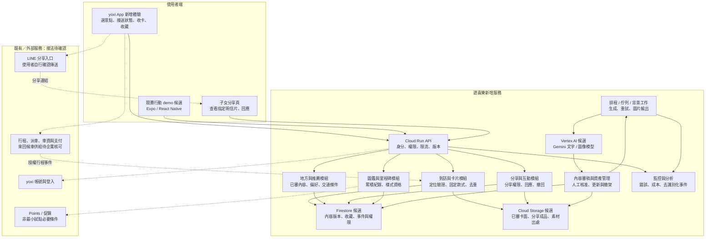

# 方案架構｜把出行、明信片與家人互動接在一起

> 對應：方案架構、技術與運算資源。
> 結論：沿用 yoxi 既有出行能力，新增地方內容、到訪收卡與分享服務；AI 支援內容供給，權限與收錄規則由程式控制。
> 待確認：來回候車的企業產品與 API、定位驗證參數、分享登入策略、里程碑樣式及資料保存期限。

## 1. 正文草稿

遊喜樂以 yoxi 既有 App 為服務入口，將景點推薦、去回程接送、抵達探索、明信片與家人互動串成同一條流程。使用者選定景點後，由企業核可的出行方案處理叫車、候車與回程；新增模組則在抵達條件成立後，提供可保存與分享的當次明信片，逐步累積個人圖鑑。候車與回程的供給、費率及接口仍需企業確認。

系統分為行動端、遊喜樂應用服務、AI 內容產線、資料儲存與外部接點。行動端負責操作與呈現，應用服務管理權限、到訪、卡片及家人回應；AI 產線事先生成地方文案與卡面，經人工核准後上架。正式行程、車資、支付及 Points 仍以 yoxi 授權服務為準，不由新模組另建一套帳務或派遣系統。

初期可從少量已查核景點與已有素材開始，以既有入口提供服務，不把獎池或額外行銷作為必要前提。之後若有使用證據與營運資源，再增加地方內容、客製樣式或企業促銷串接。這個起步方式仍需要基本接入、驗證與素材維護，成本於 04 章分列。

## 2. 完整架構圖（提案）

實線表示提案內資料流，虛線表示需企業／第三方授權或後續驗證的接點；不是已連線系統圖。

方塊是責任分工，不表示每個模組都部署一個微服務。最初採模組化 API 加背景工作即可。Cloud Run 是應用服務與工作程序的候選，部署能力依[官方文件](https://docs.cloud.google.com/run/docs/overview/what-is-cloud-run)核對（2026-09-29）。企業若已有相同服務，優先重用並只估增量。

## 3. 既有能力與新增能力

| 項目 | 分工 | 不能預先承諾的事 |
|---|---|---|
| 帳號、正式叫車、支付 | 沿用企業服務 | 競賽有資料不等於取得叫車 API |
| 去程、候車、回程 | 沿用或由企業擴充行程產品，新模組呈現狀態 | 目前來回流程為模擬，不表示 yoxi 已有同款候車商品 |
| 地方內容與推薦 | 新增內容管理及推薦接口 | 不推未查核、無開放資訊的地點 |
| 定位與抵達收卡 | 新增到訪驗證與冪等收錄 | 手機位置與按鈕操作不是付款或點數證據 |
| 卡面與短句 | AI 預生成，審核後依規則組合 | 「當次專屬」不等於每次即時重新生圖 |
| LINE 分享與家人回應 | 分享指定內容連結，回應存於自有服務 | 不讀取 LINE 聊天內容，也不自動傳送給聯絡人 |
| 圖鑑與里程碑客製樣式 | 確定性規則，達到公開門檻核發資格 | 原型已有獎章；客製樣式屬提案，不宣稱已建置 |

## 4. 資料需求與可能新增的用戶資訊

| 資料 | 可支持的服務 | 取得前提與邊界 |
|---|---|---|
| 企業提供的時段、頻率、熱門上下車區域與 POI 趨勢 | 初步選點、城市內容供給 | 彙總資料不能直接對應某位登入者 |
| 使用者自選興趣、可接受步行距離與通知偏好 | 初次推薦與操作簡化 | 可略過、修改；不推定年齡或健康狀態 |
| 地方曝光、查看、選擇、收藏、略過 | 判斷哪些內容有用、改善排序 | 保留曝光分母及版本，一次點擊不等於確定喜好 |
| 位置、精度、時間戳、場域位置 | 判斷抵達與探索 | 精確證據只按必要期限保留；不預設持續背景追蹤 |
| 授權行程識別碼與狀態 | 配對去程、候車、回程及搭車款式 | 不把電話、付款資料或原始軌跡送入模型 |
| 地方、到訪序次、卡片版本、累積里程 | 首訪、回訪、里程紀念、圖鑑 | 舊卡依當次規則保存，不能隨新版改樣 |
| 分享事件與子女在自有頁的回應 | 顯示家人互動、衡量分享價值 | 只取得本服務內的回應，不取得 LINE 私訊 |

建議事件包含 actorKey、eventType、placeId、recommendationId、contentVersion、occurredAt。actorKey 若仍可連回個人，就不稱為匿名。個人日誌、照片與回應分別設存取權限，分享只公開使用者選定的卡，不附上下車地址或完整行程。

保存／刪除期限、分享連結效期與回應身分方式是待企業確認的產品設定；未知欄位不先寫成已能取得。競賽資料依既有官方規範使用，不放入公開 repo。

## 5. Expo 的位置

Expo＋React Native＋TypeScript 是獨立行動 demo 的候選，可用同一套主要流程驗證 iOS／Android 操作。原型 HTML／CSS 與 DOM 事件仍需移植，不能直接改檔名變成原生 App。正式導入以 yoxi 既有技術棧為優先，新增 API 可供原生端使用。

需要自訂原生依賴時採 development build；Expo Go 能開畫面不代表正式定位、分享與 SDK 都通過。[Development builds](https://docs.expo.dev/develop/development-builds/introduction/)（2026-09-29）。官方對既有原生 App 整合仍標 alpha，正式嵌入需另作相容性試驗。[Brownfield 文件](https://docs.expo.dev/brownfield/overview/)（2026-09-29）。

定位先以前景取樣與權限處理驗證，背景能力依平台限制另測。[Expo Location](https://docs.expo.dev/versions/latest/sdk/location/)（2026-09-29）。裝置憑證可評估 [SecureStore](https://docs.expo.dev/versions/latest/sdk/securestore/)；模型金鑰與企業私鑰只留伺服器。

## 6. 正式服務的可靠性

- 收卡、分享與資格逐筆驗證歸屬；編輯發布權限與使用者權限分開。
- 行程事件驗簽、去重、檢查順序；手機重送不重複發卡或回饋。
- AI 超時使用已審卡面與文字模板；背景工作失敗可恢復，不阻塞既有叫車。
- 內容具來源與版本，支援撤架、替換與回退；監控生成費、傳輸量、錯誤及回應延遲。
- 家人回應有刪除、回報與限流；正式接送的停靠、候車、超時與客服處理由企業流程承接。
- `asia-east1` 是部署候選，不代表所有模型均能在台灣處理資料；逐型號核對區域，服務等級與復原目標待企業確認。

工程與內容資源見 [04 章](04-cost-and-resources.md)。目前 web app 契約仍在 [app/ARCHITECTURE.md](../../app/ARCHITECTURE.md)，本章不將它改寫成已存在的雲端系統。
