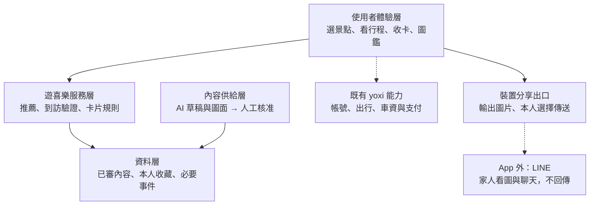
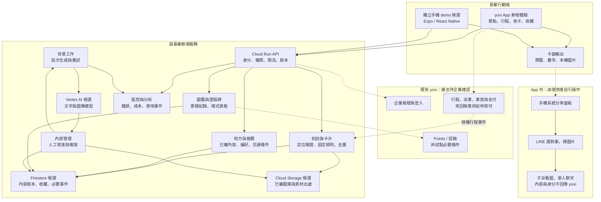
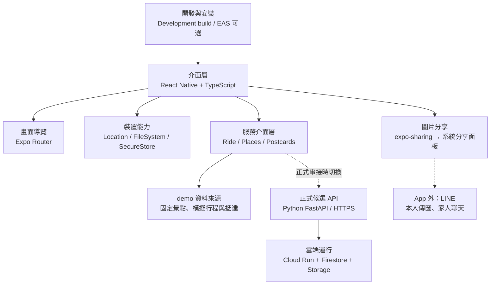
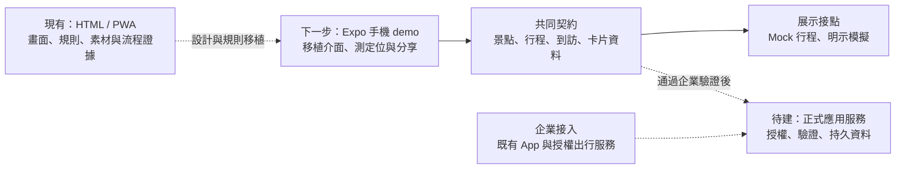

# 方案架構｜App 留下旅程，分享延伸到 LINE

> 對應：方案架構、技術棧與運算資源。
> 結論：沿用 yoxi 出行能力，新增推薦、收卡與圖鑑；App 輸出明信片，家人互動發生在 LINE。
> 狀態：HTML／PWA 已有原型；Expo 行動端與雲端 API 是建議實作方案，尚未建置。

## 1. 正文草稿

遊喜樂以 yoxi 既有 App 為服務入口，將景點推薦、去回程接送、抵達探索與明信片收藏接在一起。使用者選定景點後，由企業核可的出行方案處理叫車、候車與回程；新增模組則在抵達條件成立後提供當次明信片，累積個人圖鑑。候車與回程的供給、費率及接口仍需企業確認。

**分享流程中，App 的責任到「製卡、收藏、開啟分享」為止。** 長輩透過手機分享面板選擇 LINE，再自行選擇家人傳送圖片；子女在 LINE 內看圖、回話或傳貼圖。這段互動承接既有聊天習慣，不要求子女安裝遊喜樂、註冊或進入另一個回應頁，也不將私人聊天回傳給 yoxi。圖鑑在有效收卡時累積，與分享是否送出、子女是否回覆無關。

技術分為行動介面、應用服務、內容產線與資料儲存。AI 事先協助生成地方文案與圖面，經人工核准後發布；抵達時使用已審圖面，依日期及紀念規則組卡。正式行程、車資、支付與 Points 以企業授權服務為準。初期可從少量已查核景點與已有素材起步，不以額外行銷或獎池作為啟動條件。

## 2. 先看責任分層

這張圖回答「誰負責什麼」，先把使用體驗與供應商名稱分開。家人互動是服務帶來的外部價值，並不是我們新增的資料庫。

## 3. 完整服務架構（提案）

實線表示提案內資料流，虛線表示跨平台移交或企業接點。外部 LINE 區域沒有回到資料庫的聊天資料線；這不是已連線系統圖。

方塊是職責，不代表一個方塊部署一個微服務。初期用一個模組化 API 加背景工作即可。API 管理帳號權限和卡片紀錄，行動端讀取已審素材組卡並匯出圖片；使用者照片與心情優先在裝置處理。若未來改採伺服器輸出個人卡面，再另定上傳、刪除與保存規則及成本。

[Cloud Run](https://docs.cloud.google.com/run/docs/overview/what-is-cloud-run) 是 API 與工作程序的部署候選（查閱 2026-09-29）。企業已有同類服務時優先重用，只評估新增用量。

## 4. 既有能力與新增能力

| 項目 | 分工 | 現況與前提 |
|---|---|---|
| 帳號、正式叫車、支付 | 沿用企業授權服務 | 取得競賽資料不等於取得叫車 API |
| 去程、候車、回程 | 新模組顯示企業行程狀態 | 現有行程為模擬；來回商品、費率和供給待核可 |
| 地方與推薦 | 新增內容管理、過濾與排序 | 候選地方先查核，不生成未知車資或景點 |
| 定位與收卡 | 新增到訪驗證、固定規則與去重 | 手機訊號不能單獨證明付費行程 |
| 卡面輸出 | 已審圖庫＋當次紀念元素 | 每次組卡不必重新生圖 |
| 分享至 LINE | 行動端交給系統分享面板 | 本人選對象；App 不建立子女回應頁 |
| 圖鑑與客製樣式 | 依有效收錄紀錄計算 | 現有獎章與未來客製樣式須區分 |

## 5. 資料需求與可觀測範圍

| 資料 | 用途 | 取得前提與限制 |
|---|---|---|
| 企業提供的時段、頻率、熱門區域與 POI 趨勢 | 初步選點、內容供給 | 彙總資料不能直接對應某位登入者 |
| 自選興趣、可接受步行距離、通知偏好 | 初次推薦與操作簡化 | 可略過、修改；不推定年齡或健康狀態 |
| 曝光、查看、選擇、收藏、略過 | 改善排序、判斷內容有用程度 | 保留曝光分母、版本；一次點擊不是確定喜好 |
| 位置精度、時間戳與場域位置 | 判定有效到訪 | 必要期限保留；不預設持續背景追蹤 |
| 授權行程識別碼與狀態 | 配對接送及搭車款式 | 不把電話、付款資料或原始軌跡送模型 |
| 地方、到訪序次、卡片版本與里程 | 首訪、回訪、紀念與圖鑑 | 舊卡依當次規則保存 |
| 製卡、圖片輸出、點擊分享、分享介面呼叫狀態 | 評估卡面使用及分享意圖 | 僅是己方事件，不等於實際送出或家人看到 |
| 子女身分、聊天內容、已讀、貼圖、回覆次數 | **不列入收集資料** | 在 LINE 發生，沒有回傳通路，也不推估家庭關係 |

建議己方事件包含 actorKey、eventType、placeId、cardId、contentVersion、occurredAt；資料可連回個人時不稱為匿名。匯出僅包含本人預覽選定的圖文，不附精確上下車地址、完整行程、私密日誌或定位 metadata。

「分享」要分清楚三件事：App 內點了按鈕、系統受理分享呼叫、外部家人真正接收並回應。主方案只觀測前兩者中平台實際支援的部分。若要研究家人互動價值，可用自願訪談或問卷；受訪者自述與產品事件分開呈現，不能寫成系統已蒐集的聊天數據。

## 6. Expo 行動 demo 的技術棧

**建議用 Expo＋React Native＋TypeScript 做獨立手機 demo。** 它用來驗證 iOS／Android 的操作、定位權限與圖片分享。現有 HTML／PWA 是流程與視覺規格來源；正式 yoxi App 採什麼技術仍以企業現況為準，並不因採用 Expo demo 而要求企業重寫 App。

### 6.1 技術如何接在一起

圖中的裝置能力由 Expo SDK 提供接點，叫車與內容資料透過我們定義的服務介面取得；AI 金鑰與企業私鑰留在伺服器。

### 6.2 選用理由與 demo 範圍

| 層 | 候選工具 | 用在本案的地方 | 選用理由／要驗的事 |
|---|---|---|---|
| 手機畫面 | React Native＋TypeScript | 景點、行程、明信片、圖鑑 | 共用主要 UI 與資料型別；iOS／Android 仍各自實機驗證 |
| 導覽 | Expo Router | 景點 → 行程 → 卡片、返回行為 | 路由明確；不把現在 HTML DOM 直接當原生畫面 |
| 定位 | expo-location | 前景取樣、精度、權限提示 | 先不用背景追蹤；demo 模擬座標另標示 |
| 卡面與檔案 | 原生視圖／SVG 排版＋圖片輸出元件、expo-file-system | 已審底圖加字，輸出暫存 PNG／JPEG | 不逐次呼叫生圖；輸出元件須驗字型、照片與低記憶體情境 |
| 對外分享 | expo-sharing | 分享裝置上的卡面檔案 | 交給系統面板，使用者選 LINE；不建 LINE 內聊天功能 |
| 裝置憑證 | expo-secure-store | 儲存登入所需小型憑證 | 不放企業私鑰或模型金鑰，也不用來存整張照片 |
| API | Python＋FastAPI，型別化 JSON 契約 | 景點、到訪驗證、卡片、圖鑑 | 可銜接既有 Python 工具；正式後端仍是待建的提案 |
| 運行與資料 | Cloud Run、Firestore、Cloud Storage | API、收錄紀錄、已審素材 | 分開結構化資料與檔案；手機不直接寫權威里程或資格 |
| AI 產線 | Vertex AI／既有離線生成器 | 草稿、候選圖與人工審核 | 非叫車必要依賴；App 讀已審版本 |
| 安裝與展示 | development build；EAS Build 可選 | 自訂原生依賴及實機安裝 | EAS 是建置選項，不是 App 執行期後端；開發帳號及費用另估 |

能力依官方文件核對（2026-09-29）：[Router](https://docs.expo.dev/router/introduction/)、[Location](https://docs.expo.dev/versions/latest/sdk/location/)、[FileSystem](https://docs.expo.dev/versions/latest/sdk/filesystem/)、[Sharing](https://docs.expo.dev/versions/latest/sdk/sharing/)、[SecureStore](https://docs.expo.dev/versions/latest/sdk/securestore/)、[FastAPI](https://fastapi.tiangolo.com/)、[development builds](https://docs.expo.dev/develop/development-builds/introduction/)、[EAS Build](https://docs.expo.dev/build/introduction/)。這是選型提案，不代表 repo 已有 Expo 專案或正式 API。

手機可分享本機檔案，但 Expo 網頁端有不同限制；現有 `file://` HTML 能演示按鈕，不代表可等同驗證手機分享。真正的交付驗證要在安裝有 LINE 的裝置進行。卡面優先以成品圖片分享，不需先建立公開家庭網頁。

### 6.3 從現有原型到正式接入

兩條路徑共用資料契約，不共用假成功：demo 的 `RideService` 可回傳模擬報價、候車與回程狀態；正式實作須替換成經核可的服務介接，另驗證權限、取消、錯誤和事件去重。未取得叫車 API 時，demo 明示模擬，不真的下單。

既有 yoxi App 可由其原生團隊接同一組新 API；若企業希望嵌入 React Native 模組，再做 brownfield 相容性驗證。Expo 官方目前仍將此整合支援標為 alpha，不列為本次導入前提。[官方文件](https://docs.expo.dev/brownfield/overview/)（2026-09-29）。

## 7. 正式服務的可靠性

- 收卡與資格由伺服器驗證歸屬；編輯發布權限與一般帳號權限分開。
- 行程事件驗簽、去重、檢查順序；手機重送不重複發卡或回饋。
- AI 超時使用已審圖面或模板，不阻塞叫車與回程。
- 內容具來源與版本，可撤架與回退；監控模型費、傳輸量及錯誤。
- App 內收藏可依規則刪除，但匯出到 LINE 的圖片副本不能由 App 撤回。
- `asia-east1` 是部署候選，不代表所有模型都在台灣處理資料；逐型號核對區域。

人力與成本見 [04 章](04-cost-and-resources.md)。現有程式契約見 [app/ARCHITECTURE.md](../../app/ARCHITECTURE.md)；本次只整理文件，不改 App 程式。
