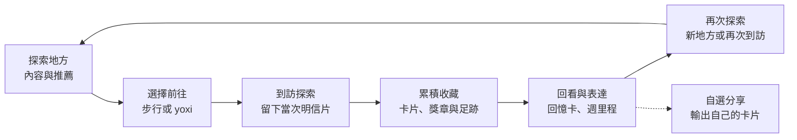
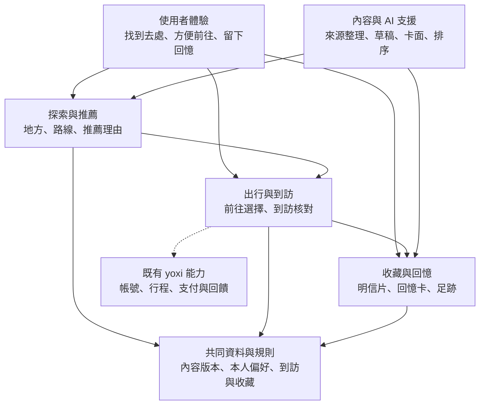

# 方案架構｜讓探索、出行與收藏形成持續使用的理由

> 本章說明遊喜樂的服務主軸、核心能力與導入方式。
> 核心：以地方探索帶動出行，以到訪收藏累積個人價值，再延伸下一次探索。
> 現況：已有 HTML／PWA 體驗原型；個人化推薦、正式到訪驗證與企業服務接入仍屬提案。

## 1. 從一次移動，延伸為可以累積的城市經驗

遊喜樂以 yoxi 為入口，把「找到想去的地方」「前往與到訪」「留下這次經驗」接成一段連續的服務。使用者在出發前透過地方內容與推薦形成目的地，依距離與自身需求選擇步行或搭車，抵達後收下一張與地點及當次到訪相關的明信片。這些卡片持續累積成個人收藏，也能結合照片與心情製作回憶卡，讓每一次出門都能留下可回看的內容。

對使用者而言，服務同時降低找地方的負擔，並提供記錄生活的方式；對 yoxi 而言，探索提供非叫車時段的使用情境，也讓目的地自然銜接既有叫車入口。收藏與回憶則提供再次開啟 App 的理由。這些是本案要驗證的價值假設，後續需分別觀察探索使用、實際到訪、收藏回看與探索衍生的搭車行為，才能判斷哪一段值得持續投入。

長輩是本案優先示範的使用情境：少量清楚的地方建議、簡單的前往選擇，以及可直接保存的卡片，降低操作與表達的負擔。需要接送時由 yoxi 承接；想把生活近況傳給家人時可自選分享。即使只在附近走走、自己收藏，仍是一段完整的使用體驗。

## 2. 整體服務循環

本案的核心是讓每一次到訪都能接上後續使用。探索提供新的去處，出行把意圖變成實際到訪，收藏保存這段經驗，回憶與足跡再喚起下一次探索。圖中的回路表示設計目標，是否真的形成回訪與持續使用，需由試點觀察。

這個循環需要同時顧好內容、出行與收藏。地方不夠吸引人，使用者就不會形成前往意圖；前往流程太繁複，探索難以接到真實到訪；留下的內容缺乏地方特色，收藏也難以產生長期價值。因此，評估時不能只看某一個分享按鈕或單次卡片生成，要逐段確認體驗是否接得起來。

## 3. 三個核心服務與共同支援能力

探索與推薦負責回答「接下來可以去哪裡」。系統以已查核地方庫為基礎，結合使用者自選興趣、可接受的移動條件與授權互動，提供可理解的推薦理由。內容先有可信的來源與可到訪性，再談個人化排序。

出行與到訪負責把選擇接到現實行動。使用者查看地方後，可以步行前往，或將目的地帶入 yoxi 的叫車流程。抵達後，服務核對到訪條件，再留下當次明信片。來回接送可作為長輩情境的延伸選項，正式供給、候車條件與費率須依企業核可方案處理。

收藏與回憶負責保存個人的城市經驗。正式服務應讓地方卡片、到訪紀錄、獎章與足跡共同依據有效到訪資料，並清楚定義各項統計的範圍。現有原型的足跡只呈現底圖能辨識的地方，不能把卡片總數直接當作地圖上的地點數。回憶卡則讓使用者從去過的地方出發，加入自己的照片與心情；公開地方素材與個人表達因此各有用途，也能共用卡片的視覺語言。

圖中的三個核心服務是產品職責，不要求拆成三套獨立系統。試點可以使用一個模組化後端，將內容、到訪與收藏的規則分清楚，再依真實用量決定是否擴充分工。AI 作為共同支援，協助整理內容、建立素材與提供建議；正式行程、金額與收藏資格仍由明確的服務規則處理。

| 核心服務 | 使用者得到的結果 | 試點要觀察的問題 |
|---|---|---|
| 探索與推薦 | 適合自己、知道為何推薦的地方 | 建議是否有用，是否形成前往意圖？ |
| 出行與到訪 | 清楚的前往選擇與可保存的到訪紀錄 | 探索是否接到步行或搭車，到訪是否能可靠記錄？ |
| 收藏與回憶 | 可回看、可整理、可表達的個人內容 | 使用者是否願意保存，之後是否再次回來使用？ |

## 4. 資料如何支援這段體驗

地方內容庫是服務的共同底座，保存地點、主題、可用資訊、素材來源與發布版本。編輯先確認哪些地方值得推薦，AI 協助整理草稿與候選圖面，核准後才提供給使用者。這讓推薦與卡片使用同一份地方資料，也讓資訊更新能追溯到受影響的內容。

個人資料則以自選偏好、授權互動與到訪收藏為主。初次使用時可以直接看編輯精選，逐步累積選擇後再改善排序；一次點擊只是一個訊號，不能直接視為確定喜好。企業提供的彙總出行趨勢可用於選點與內容規劃，若無個人層級授權，便不拿來推定某位使用者的生活史。

觀測資料要能對應產品決策。例如，地方曝光與查看可判斷內容吸引力，前往選擇與有效到訪可判斷行動銜接，收藏回看與再次探索可判斷持續使用價值。所有比率保留分母與版本；探索帶來的搭車須沿用可追溯的入口紀錄，並與原本就有的叫車需求分開評估。

## 5. 由原型走向試點，再決定擴大投入

目前 HTML／PWA 已能展示探索、模擬行程、收卡、收藏與回憶卡的連續操作，適合先驗證使用者能否理解流程。現有回憶卡以地點模板、本機照片與心情組合成示意，尚未接線上 AI；現有行程與定位示意也不等同正式服務已串接。

試點先查核少量真實地方，逐張複核可沿用的示意卡面與授權，再讓「看見地方—前往—收卡—回看」整段可用。推薦理由是第一個面向使用者的 AI 驗證點：以本人選定的興趣與可用地方特徵產生短句，和固定模板比較理解度與前往意願；內容產線同步比較 AI 草稿與人工版本的品質及工時。規則推薦與模板保留為對照及備援，讓評估能辨認 AI 帶來的增益。只展示漂亮卡面或分享操作，還不足以回答 AI 是否改善核心體驗。

當有效到訪、收藏回看與內容維護需求逐漸清楚，再增加地方、路線及個人化能力。這個順序將新增內容量與真實使用連在一起，也能先看見編輯、維運與雲端的實際負擔。各階段的投入與估算範圍見 [成本與資源](04-cost-and-resources.md)。

獨立手機 demo 可評估 Expo／React Native／TypeScript，以檢查定位、圖片輸出及裝置操作；若既有 PWA 已足以驗證體驗，可先沿用。正式接入 yoxi 時依企業原有技術決定實作方式，共用的是資料與服務契約。詳細部署、API 與裝置接點放在 [技術附錄](notes/technical-appendix.md)。

## 6. 服務邊界與驗證重點

叫車的既有操作應維持清楚，新增探索入口不能增加不必要的步驟或遮住必要資訊。推薦或生成暫時不可用時，仍可使用已審地方內容與卡面；重送到訪請求時取回同一張卡，避免重複計入收藏。這些條件讓新增體驗具備可靠的基礎。

分享是收藏的自選延伸，由使用者預覽圖片後交給系統分享面板；外部聊天留在使用者選擇的平台。正文以製卡、收藏與再次使用評估核心服務，外部家人回應的價值另以自願訪談了解。詳細資料邊界集中在技術附錄，讓主線保持清楚。
