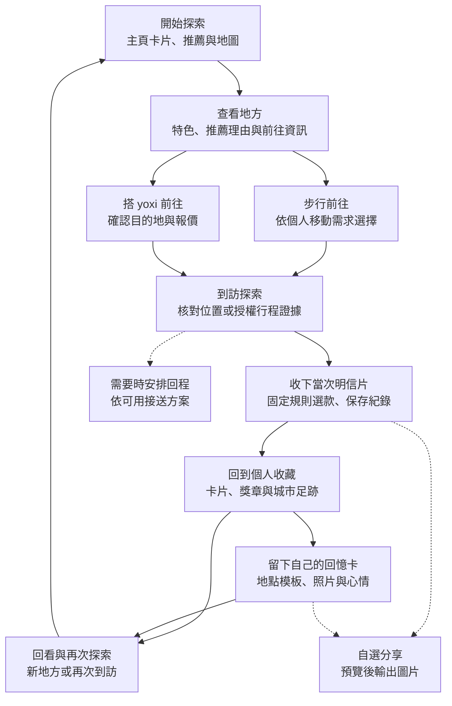

# 流程設計｜從找到去處，到留下自己的城市回憶

> 本章說明使用者旅程、系統回應與例外處理。
> 主線：探索地方 → 選擇前往 → 到訪收卡 → 收藏與回憶 → 再次探索。
> 現況與提案分開：畫面及部分規則已有原型，正式行程事件與到訪核對需接入企業服務。

## 1. 用一段完整旅程串起功能

使用者打開遊喜樂時，未必已經有明確的交通需求。他可能想找附近可走走的地方，也可能看到有興趣的景點，希望安排一趟出門。流程先協助他找到去處，再提供適合的前往選擇，讓探索與叫車依實際需求相接。

抵達後，地方明信片把「曾經來過」轉成可保存的紀念。收藏頁讓這些經驗逐漸累積；回憶卡則讓使用者再加入自己的照片與心情。下一次開啟時，可以回看過去，也可以從原有收藏延伸新的地方。分享是其中一個選項，主流程本身就能提供價值。

圖中的實線是核心使用路徑，虛線是使用者依需要選擇的延伸。走路、搭車、回程與分享各有自己的條件；卡片與收藏依有效到訪累積。以下依旅程說明每一步如何銜接。

## 2. 出發前：把有興趣的地方變成清楚的選擇

探索入口以主頁卡片與地圖上的地方提供少量有特色的選擇；點開卡片後，在浮動小卡查看地方與前往資訊。這與目前雙主頁原型的操作一致，舊的獨立詳情頁留作歷史流程。正式推薦在初次使用時可提供編輯精選，取得本人設定或授權互動後再加入個人化排序。地方介紹先說明值得去的原因，避免使用者只看到漂亮卡面卻不知道那裡有什麼。

推薦理由必須連回可用的條件，例如使用者自選主題或地方與目前探索區域的關係。系統只從上架地方庫選取，不生成不存在的地點或未知的營業資訊。資料不足時回到可查核的介紹，仍讓使用者自行選擇。

選定地方後，使用者依距離、時間與自身需求選擇步行或 yoxi。步行路徑保留日常探索的使用情境；搭車入口將地方帶入目的地，接續既有確認與叫車流程。原型中的距離、時間與車資用同一套公式示意，正式服務則使用企業核可的資訊，讓探索內容與實際出行一致。

## 3. 出行中：讓接送與到訪各自清楚

步行前往時，畫面提供目的地與到訪提示；搭車時，使用者確認上下車點及報價後，依既有行程狀態前往。AI 推薦到此已提供建議，實際叫車仍由本人確認。已在行程中的使用者應能容易找到行程與必要聯絡入口。

長輩情境可以進一步展示「去程—附近探索—回程」：先挑一個適合停靠與短距離走動的地方，需要時選擇可供應的來回接送。候車與費用規則要在出發前說清楚；回程由本人依需要安排，不等待收卡或分享。現有原型包含來回候車示意，正式商品、供給及費率仍待企業核可。

到訪核對是出行與收藏之間的接點。正式服務需綜合位置精度、取樣時間、場域條件與可用的授權行程證據；不能僅憑一個座標就認定有效到訪。原型中的距離與停留條件是展示規則，試點需針對不同場域驗證誤判與漏判，再調整適用門檻。

## 4. 抵達後：讓當次經驗成為可保存的卡片

符合收錄條件的到訪會取得明信片。系統依地點、日期、季節、交通方式與收錄歷史選擇既有款式，再加上對應紀念元素。使用者能理解為何拿到這張卡，也能在之後回看時辨識它屬於哪一次到訪。

卡面可以預先生成與審核，抵達時直接組合成品。這樣既可維持畫面品質，也不必讓使用者站在景點等待模型出圖。若圖片載入或輸出失敗，先保留有效到訪及收藏紀錄，恢復連線後再取回卡面。

| 收錄原則 | 使用者看到的行為 | 系統需要處理的事 |
|---|---|---|
| 有效到訪可收卡 | 符合條件即可留下當次紀念 | 到訪核對、帳號歸屬與頻率規則 |
| 同地同日一張 | 同一次操作重試仍看到同一張 | 請求去重、日期與時區一致 |
| 再次到訪可留下新紀錄 | 舊卡保留原日期與款式 | 卡片與地方分開計數，保存當次版本 |
| 款式有固定依據 | 季節、搭車與紀念元素可說明 | 規則計算與數字由程式處理 |

目前已有固定選款、再次到訪與紀念元素的原型規則。正式資格由後端的有效紀錄判定；圖鑑與獎章沿同一份收藏資料計算。額外的客製相框、稱號或新里程碑樣式先留在擴充討論，不作本次核心旅程與預算的必要前提。

## 5. 回到 App：從收藏延伸自己的表達

收藏首頁提供明信片、回憶卡、週里程、城市足跡與獎章的入口。這些內容代表不同的回看方式：卡片記住地方，里程整理出行，足跡呈現去過的範圍。它們共同回答「我留下了哪些經驗」，而不是反覆呈現相同數字。

回憶卡從到訪過的地方模板開始，使用者可以加入照片與心情，再保存自己的版本。當天沒有到訪紀錄時，原型會清楚說明使用最近去過的地方；沒有收藏時則回到探索。現有實作在本機處理照片與模板排版，未接線上 AI；後續如加入生成能力，先驗證它能否減少修改負擔、保留地方特色與本人意思。

下一次開啟時，使用者可直接回看收藏，或再次找地方。以本人授權的到訪與興趣支援後續推薦，是未來可評估的服務方向；不把這個循環已經畫在圖上，視為已證明能提升留存。通知作為自選入口，沿用可關閉與頻率控制，避免以提醒量取代內容價值。

使用者想分享時，在卡片上預覽自己選定的圖文，再交給系統分享面板。圖片可帶到 LINE 等既有工具，外部聊天不回傳遊喜樂。完整分享資料邊界見 [技術附錄](notes/technical-appendix.md)，主流程的收藏與回程各自運作。

## 6. 例外情境要能回到原本的旅程

流程設計除了順利使用，也需要讓中斷可恢復。推薦暫時不可用時，以編輯精選維持探索；拒絕定位時，仍能閱讀內容與叫車，收卡另依可用證據補驗；重送請求時，應取回原本的行程或收藏結果，避免重複建立。

| 情境 | 保留的使用能力 | 接續方式 |
|---|---|---|
| 推薦或 AI 暫時不可用 | 已審地方、卡面與模板 | 使用備援內容，恢復後再評估更新 |
| 無車或來回方案不可供應 | 地方資訊與其他可用選擇 | 本人重新選擇交通方案並確認費用 |
| 定位精度不足 | 內容瀏覽、叫車與既有收藏 | 提示待核對，依授權證據或後續取樣處理 |
| 斷線、逾時或重送 | 已保存的到訪與卡片 | 查回同一請求，避免重複紀錄 |
| 製卡或分享中止 | 原有收藏與行程 | 回到卡片，依需要重試 |

## 7. 試點如何檢查流程是否有效

體驗驗證先看使用者能否理解推薦、選擇前往、找到自己的卡，以及再次回到收藏。工程驗證則檢查步行與搭車都能銜接收卡、同一到訪不重複計入、款式有依據、斷線可恢復，以及新增內容不干擾叫車。

成效觀察沿同一段旅程保留曝光、查看、前往選擇、有效到訪、保存與回看事件。比如地方被看過卻少有人前往，要再區分內容吸引力、交通條件與操作阻力；不能只把問題歸給推薦模型。實驗期間與通過門檻由試點設計先定，結果與訪談共同決定下一步投入。

展示時可先演示一條附近步行收卡流程，再演示需要 yoxi 的出行情境，最後回到收藏製作回憶卡。每個畫面清楚標示實際能力與模擬訊號，讓評審能同時理解服務價值與現階段的實作程度。
