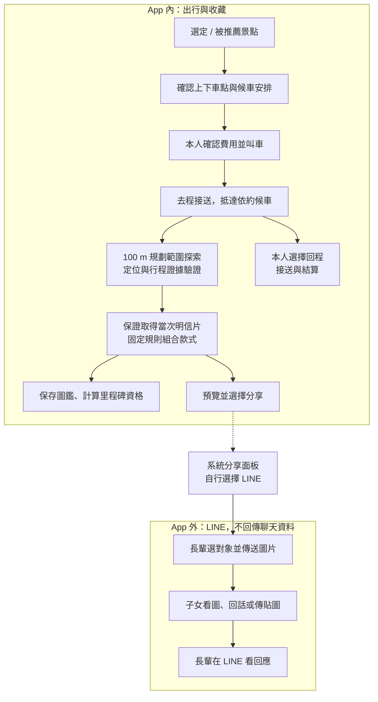
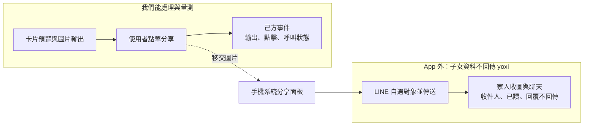
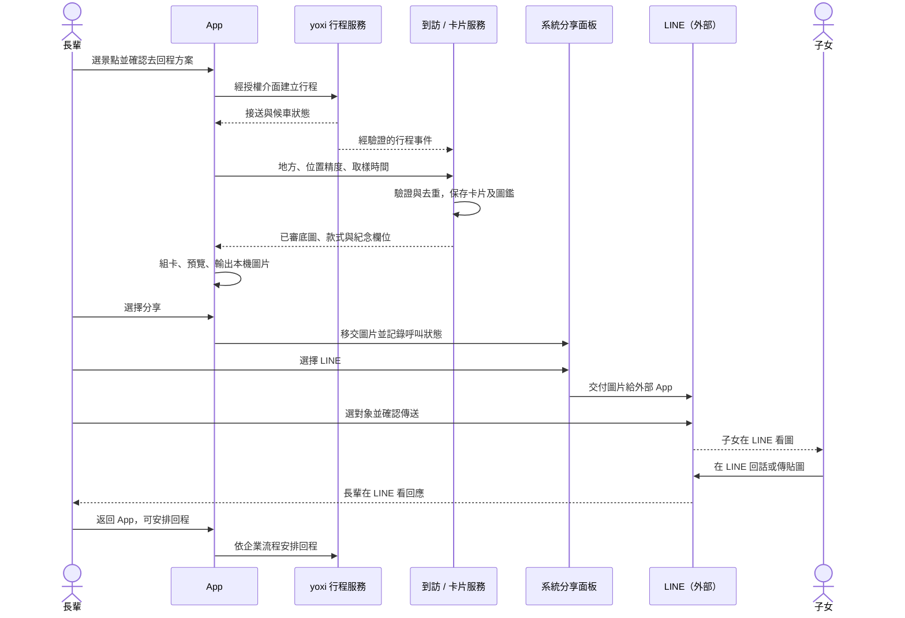

# 流程設計｜收卡留在 App，聊天留在 LINE

> 對應：使用流程、服務流程及資料應用。
> 核心：保證收卡與圖鑑由己方系統處理；對外分享後，家人互動留在 LINE。
> 前提：正式接送供給與 API 待企業確認；款式及里程碑採公開固定規則。

## 1. 正文草稿

長輩從推薦或自選景點開始，查看目的地與接送方案，確認上下車點、候車安排與費用後，由 yoxi 接送前往。抵達後，可在景點附近規劃的 100 m 探索範圍內步行；系統依位置與授權行程資料判斷到訪，提供當次明信片。符合條件即能取得，不因其他人先到而減少名額。

明信片以地方卡面為底，依常態、節慶、首訪與里程規則組合日期和紀念元素，同時保存至圖鑑。使用者預覽後可按分享，交由手機系統面板選擇 LINE，再自行選擇對象傳送。**從選擇 LINE 起，操作就進入外部 App；子女在 LINE 看圖、回話或傳貼圖，長輩也在 LINE 看回應。** 遊喜樂不接收這段聊天，也不要求家人回到 App 按讚或留言。

這條流程承接團隊提出的長輩圖分享習慣。第一次出行就能留下可分享的成果，後續到訪形成收藏；家人回應是可能帶來的情感價值，是否發生及其效果須透過自願訪談驗證，不能由分享點擊直接推定。

## 2. 使用流程圖

圖鑑與回程各自分支，不等待分享結果。外部區域的箭頭表示人的互動，不表示資料回傳。

即使沒有分享、分享中止或家人不回話，仍能保存卡片、累積圖鑑及安排回程。分享是自選出口，不是收卡或獎勵條件。

## 3. 各步驟需要的能力

| 步驟 | 輸入 | 系統處理與輸出 |
|---|---|---|
| 選景點 | 自選、興趣或已授權偏好 | 已查核地方及推薦依據 |
| 接送安排 | 上下車點、去回程意圖 | 企業報價與候車條件，本人確認後才下單 |
| 行程中 | 企業授權事件 | 狀態與聯絡入口；候車上限和費用依企業規則 |
| 抵達 | 場域、取樣座標、精度與時間戳 | 有效到訪；不足時保留可恢復的待驗證狀態 |
| 製卡與收藏 | 到訪、日期、交通方式、收錄歷史 | 已審底圖＋紀念元素，保存圖鑑及樣式資格 |
| 圖片分享 | 本人預覽選定的圖文 | 裝置產出檔案並開分享面板；僅記錄己方操作 |
| 家人互動 | **LINE 內的圖片與聊天** | **外部平台處理，遊喜樂沒有回應資料輸入或儲存** |

「100 m」是探索範圍設計，不是 GPS 精度保證，也不能保證範圍皆安全可走。上架地點需確認停靠、入口與步行動線；到訪判斷須結合精度、時間及場域條件，不只看一次座標。

## 4. 明信片款式與累積規則

| 規則 | 本稿定義 | 現況／提案 |
|---|---|---|
| 基本取得 | 有效到訪且符合收錄頻率就取得，不設共享名額 | 固定規則已有 PoC，正式驗證待建 |
| 收錄頻率 | 同一人、同一地方、同一天一張，隔日可記回訪 | 現況；正式時區由後端統一 |
| 常態款 | 依季節或交通方式選基本樣式 | 目前四季畫風及搭 yoxi 金框 |
| 節慶款 | 公開節日區間疊加視覺 | 現況；年度資料需維護，不以限量分配 |
| 首訪紀念 | 首次收錄地方附紀念元素 | 現況；正式依帳號紀錄判定 |
| 里程紀念 | 驗證里程跨過規則門檻附紀念元素 | 現況有示意，正式距離依企業事件 |
| 圖鑑 | 地方、卡款與回訪分開統計 | 不混算人數、地方數和卡片數 |
| 里程碑客製樣式 | 依公開條件提供相框／祝福排版等 | 提案，樣式與門檻待選 |

款式、收錄與資格都不依子女回話或分享成功判定。客製樣式先以程式排版為候選，不以現金獎池或即時生圖為必要條件。

「當次專屬」由 visitId、日期、款式、交通方式、紀念元素與選填文字構成，底圖可重用。若輸出失敗，先保存到訪及卡片資格，使用基礎圖面並可重試，不丟失本次收錄。

## 5. 分享與資料邊界

這張圖將「圖片離開 App」與「資料可否回來」分開。App 內事件可供產品分析，外部私訊沒有回傳線。

| 觀測項目 | 可以怎麼說 | 不可推論 |
|---|---|---|
| 卡片輸出成功 | 裝置已產出可分享的檔案 | 不是送出，也不是有人收到 |
| `share_tapped` | 使用者有分享意圖 | 不知道選了 LINE 或哪一位家人 |
| `share_invocation_resolved` | 分享 API 呼叫返回，語意依平台記錄 | 不等於傳送成功或已讀 |
| App 再次進入前景 | 使用者回到 App | 不知道是取消、送出或只是切換程式 |
| 家人回話、貼圖、已讀 | **不在產品事件中量測** | 不以返回 App、停留時間推估 |

Expo `Sharing.shareAsync()` 開啟檔案分享面板，回傳 `Promise<void>`，不是收件確認。React Native 的文字分享 API 在 Android 會回傳 `sharedAction`，也不能把它當作家人接收或回應證據。[Expo Sharing](https://docs.expo.dev/versions/latest/sdk/sharing/)、[React Native Share](https://reactnative.dev/docs/share)（2026-09-29）。本案以圖片匯出為主，兩種 API 的回傳語意不混用。

可用「點擊分享人數／看過可分享卡片的人數」觀察分享意圖，與有效到訪、回訪、再次打開圖鑑分開統計；報表不命名為「家人回覆率」。家人互動是否有價值，另做自願訪談或問卷，不收集聊天記錄作為操作前提。

## 6. 核心服務時序

時序展示責任交接。家人聊天沒有進入卡片服務；回程可隨時安排，不必等待上述分享步驟。系統面板的返回值只依 SDK 能力處理，不補造傳送、收件、已讀或回覆事件。

## 7. 介面契約草稿

以下是新服務候選契約，不是 yoxi 已公開規格。LINE 外部聊天不需要為本案建立帳號或回應 API。

| 介面 | 欄位與限制 |
|---|---|
| `GET /v1/places` | 已上架地方、內容版本、推薦依據與有效時間 |
| `POST /v1/arrival-claims` | placeId、observedAt、accuracy、位置訊號及授權行程關聯 |
| `POST /v1/postcards` | 有效 claimId＋冪等鍵；重送取原卡、不重複計里程 |
| `GET /v1/collection` | 本人圖鑑、回訪與里程碑，數字來自權威紀錄 |
| `POST /v1/events` | 白名單事件與版本；驗證呼叫者，拒收收件人或聊天欄位 |

卡片匯出可在裝置處理，不另設公開分享網址或 `replies` API。只輸出使用者選定圖文；密鑰、日誌原文和精確地址不嵌入卡面。App 內刪除卡片不會刪掉 LINE 已傳出的副本。

## 8. 異常流程與 demo 驗收

| 情境 | 處理方式 |
|---|---|
| 無車或來回方案不可供應 | 顯示可用方案；改單程須本人再確認 |
| 報價變更／候車超時 | 依企業規則提示，卡片不左右費用或回程 |
| 拒絕定位、精度不足 | 可看內容與叫車；以授權行程證據或補驗處理收卡 |
| 斷線、逾時、事件重送 | 回查同一請求，不重複叫車、收卡或計里程 |
| 出圖失敗 | 保留卡片資格，以已審基本圖面重試 |
| 分享取消或未安裝 LINE | 返回卡片，可選儲存圖片；不顯示假傳送成功 |
| 子女沒有回話 | 外部互動未知，不影響圖鑑或回程 |
| 圖片已被外部轉傳 | App 無法撤回副本；傳出前提供清楚預覽 |

競賽 demo 先演示一個景點的選定、模擬去程／候車／回程與固定規則收卡。Expo 可接著在手機展示圖片輸出和系統分享面板，標明哪些能力真正在裝置執行、哪些行程及抵達訊號是模擬。子女在 LINE 的畫面可用情境示意說明，不做成 App 收到家人回應的假資料；實際傳送需由操作者自行選擇收件人與確認。

驗收重點：同一到訪不重複收卡；首訪與回訪可區分；款式能說明原因；斷線可恢復；匯出不夾帶私密欄位；分享／AI 故障不阻塞回程。現有 [家人示意程式](../../app/js/views/album-family.js) 是歷史概念畫面，不代表此版新增了聊天回傳服務。
