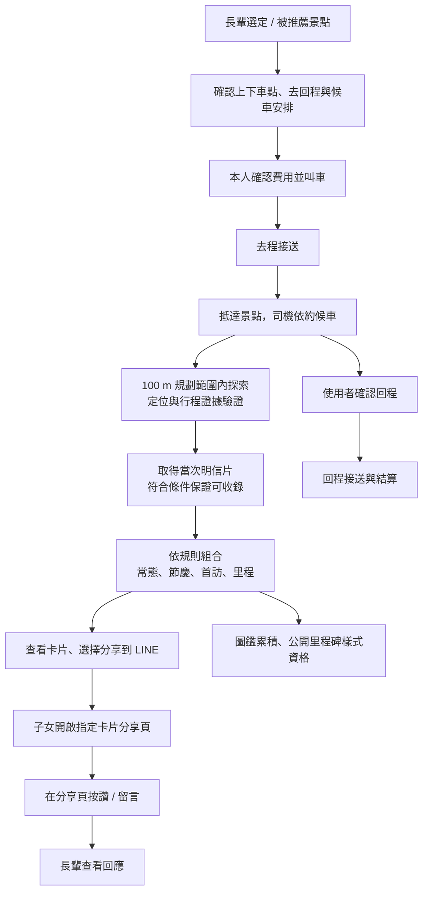
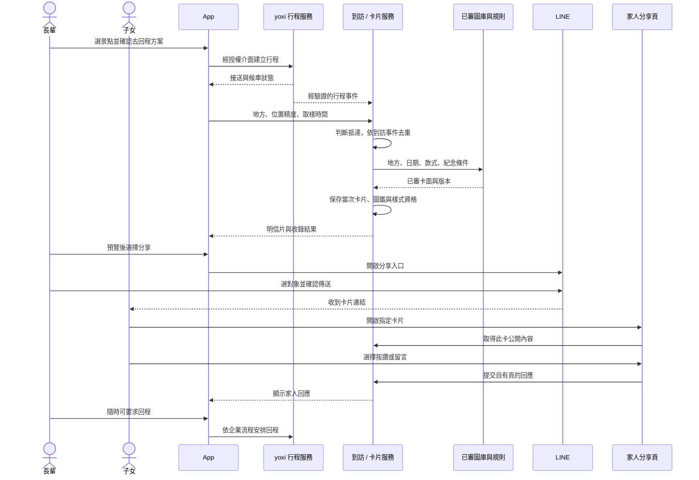

# 流程設計｜接送、探索、收卡與家人回應

> 對應：使用流程、服務流程與體驗規劃。
> 主流程依使用者提供的長輩出行情境；正式供給與 API 待企業確認。
> 保證收卡、款式、圖鑑與里程碑採公開規則，不使用機率或搶先機制。

## 1. 正文草稿

長輩從推薦或自選景點開始，查看目的地與接送方案，在確認上下車點、候車安排與費用後，由 yoxi 接送前往。抵達後，使用者可在景點附近規劃的 100 m 探索範圍內步行；系統依位置與行程資料判斷到訪，將當次明信片加入可收錄清單。符合條件即能取得，不因其他人先到而減少名額。

明信片以地方卡面為底，依常態、節慶、首訪與里程規則組合日期及紀念元素。使用者查看後可直接開啟 LINE 分享入口，把指定卡片傳給家人。子女透過分享頁查看及回應，回應再呈現在長輩端；圖鑑與里程碑則依真實收錄紀錄累積。

這條流程以團隊提出的長輩圖查看與分享習慣作情境假設，製圖操作集中在明信片呈現，不要求長輩學習複雜編輯器。第一次體驗即可留下一張可分享的成果，後續到訪自然成為收藏；實際接受程度仍需受測者驗證。

## 2. 使用流程圖

回程不以分享或子女回應為前提。使用者可先返家再收看卡片；沒有家人回應、沒有分享或不允許通知，也能取得符合條件的明信片。

## 3. 各步驟需要的能力

| 步驟 | 輸入 | 系統處理與輸出 |
|---|---|---|
| 選景點 | 自選、興趣或已授權偏好 | 已查核地方、交通與場域資訊，說明推薦依據 |
| 安排接送 | 上下車點、去回程意圖 | 查詢企業報價與候車條件，需本人確認 |
| 去程與候車 | 企業行程事件 | 呈現目前狀態與聯絡入口，候車上限和費用依企業方案 |
| 抵達探索 | 場域位置、取樣座標、精度與時間戳 | 判定有效到訪；資料不足時顯示可恢復的待驗證狀態 |
| 當次製卡 | 到訪、日期、交通、歷史收錄、里程 | 固定款式、已審圖庫、程式疊字／紀念元素 |
| 分享 | 本人選定卡片與公開欄位 | 輸出分享成品或權限連結，交由使用者選收件人 |
| 家人互動 | 分享連結、回應身分與內容 | 存於本服務，長輩端顯示回應，可刪除／回報 |
| 累積 | 有效卡片與里程紀錄 | 圖鑑統計及符合公開條件的客製樣式資格 |

「100 m」是本流程的探索範圍設計與原型參數，不是 GPS 精度保證，也不能證明整個範圍皆可安全步行。實際上架地點需確認停靠、入口與可走動動線；定位判斷需要精度、時間與場域條件，不能只看一次座標。

## 4. 明信片款式與累積規則

| 規則 | 本稿定義 | 現況／提案 |
|---|---|---|
| 基本取得 | 有效到訪且符合收錄頻率者一定取得；不設共享名額 | 固定規則已有 PoC，正式驗證待建 |
| 收錄頻率 | 先沿用同一人、同一地方、同一天一張，隔日可記一次回訪 | 現況；正式時區與同日定義由後端統一 |
| 常態款 | 依季節或交通方式選基本樣式 | 目前為四季畫風及搭 yoxi 金框；將來可調整規則版本 |
| 節慶款 | 對應公開的節日區間，疊加節慶視覺 | 現況；需維護年度資料，不以限量分配 |
| 首訪紀念 | 首次收錄該地方時附紀念元素 | 現況；正式版由帳號紀錄判定 |
| 里程紀念 | 已驗證累積里程跨越規則門檻時附紀念元素 | 現況有示意；正式距離依企業事件 |
| 圖鑑 | 依獨立地方、卡款與回訪分開統計 | 現況已有收藏與獎章；不可混算人數、地方數與卡片數 |
| 里程碑客製獎勵 | 可選相框／祝福排版／紀念樣式等，條件公開、符合即提供 | 提案；樣式與門檻待選，不能宣稱現有 App 已提供 |

客製獎勵先以程式樣式為候選，不以現金獎池或每次重新生圖為必要條件。新的獎勵範圍若採用，需另更新產品基準；本次不加回曾移除的 App 功能。

「當次專屬」由 visitId、日期、款式、交通方式、紀念元素與選填文字構成。底圖可以重用，不應向使用者宣稱每張都是即時重新繪製。生成失敗可先保留到訪及資格，提供基礎卡面，再補成品；不能悄悄吞掉本次收錄。

## 5. 核心服務時序

時序以展示資料關係為主；回程與分享可以並行，正式端不等待 AI 或家人操作。LINE 聊天本身的按讚／留言不預設能回讀，回應功能設在自有分享頁。

一般分享入口僅能記錄開啟動作，不能推論已傳送或已讀；若另外採 LIFF 的 `shareTargetPicker()`，可依其回傳判斷分享結果，但官方不提供收件人數。Messaging API webhook 處理的是官方帳號可接收的訊息，不是家人私聊的旁讀權限。依據：[LIFF 分享](https://developers.line.biz/en/reference/liff/#share-target-picker)、[Messaging API 接收事件](https://developers.line.biz/en/docs/messaging-api/receiving-messages/)（查閱 2026-09-29）。「一鍵」表示由卡片直接開啟分享，仍由使用者選擇對象及確認傳送。

## 6. 介面契約草稿

以下是提案方的候選介面，不是 yoxi 已公開 API 規格。

| 介面 | 重點欄位與限制 |
|---|---|
| `GET /v1/places` | 已上架地方、內容版本、推薦依據與有效時間 |
| `POST /v1/arrival-claims` | placeId、observedAt、accuracy、位置訊號及行程關聯；回傳驗證狀態 |
| `POST /v1/postcards` | 有效 claimId＋冪等鍵；重送取得原卡，不重複計里程 |
| `GET /v1/collection` | 本人圖鑑、回訪與里程碑；數字從同一筆權威紀錄計算 |
| `POST /v1/shares` | 本人卡片、公開欄位與效期；回傳可撤回的分享連結 |
| `POST /v1/shares/:id/replies` | 有權查看者的回應；需限流、內容處理與身分策略 |
| `DELETE /v1/shares/:id` | 本人撤回後連結不再提供內容，已另存副本不能遠端收回 |

機密 token、完整行程與精確上下車地址不出現在分享網址。公開卡片與私人日誌分開授權；不以「有分享連結」給予帳號其他資料的存取權。

## 7. 異常流程

| 情境 | 體驗與系統處理 |
|---|---|
| 無車或來回方案不可供應 | 清楚顯示可用選項；單程替代需本人重新確認，不假設同一司機能等候 |
| 報價改變／候車超時 | 依企業規則提示與確認；卡片不左右費用或回程處理 |
| 定位拒絕、精度不足 | 可繼續查看內容與搭車；以授權行程事件或補驗流程處理收卡，不把手動定位當正式證據 |
| 網路逾時或事件重複 | 顯示處理中，回查同一請求；不重複叫車、收卡、加里程或發資格 |
| AI／出圖服務失效 | 取已審成品或基礎模板，資格保存；重試在背景進行 |
| LINE 未安裝或分享中止 | 提供儲存圖片／複製連結候選；回到卡片，收藏照常保留 |
| 子女不回應 | 不影響卡片、回程或里程碑，不製造未讀壓力 |
| 分享遭轉傳或留言不當 | 顯示的是有限卡片內容；提供撤回、回報及刪除流程 |

## 8. Demo 與驗收範圍

建議先以一個景點演示選定、模擬去程與候車、100 m 抵達訊號、固定規則收卡、分享頁回應及回程；全程標明模擬行程。若正式 LINE 串接未建，分享與家人回應頁保持示意標示。

核心驗收：同一到訪不重複發卡；回訪與首訪可區分；款式能說明原因；斷線可恢復；私人資料不外洩；分享與 AI 故障不阻塞回程。里程碑客製樣式先用一個公開條件示範，不新增複雜獎勵層級。

現況依據：[App 架構](../../app/ARCHITECTURE.md)、[行程程式](../../app/js/views/ride.js)、[卡片規則](../../app/js/views/explore-cards.js)、[家人示意](../../app/js/views/album-family.js)。這些仍在迭代，交件時以選定版本核對。
