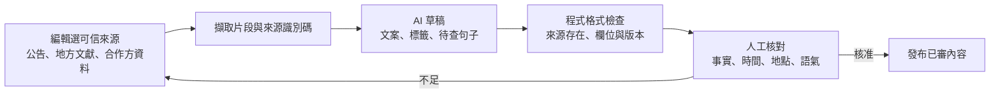

# AI 應用方法｜讓城市探索更貼近人，也讓內容能持續長大

> 對應：AI 在遊喜樂中解決什麼、使用哪些資料、如何產出，以及如何驗證。
> 結論：AI 支援推薦、可信內容、可重用圖像資產與選用式回憶表達；抵達判定、車資、收藏資格與點數仍由程式規則處理。
> 現況：已有可操作的探索、抵達、收藏與回憶卡模板；正式推薦、內容產線、雲端圖像生成與個人回憶文字仍屬導入提案。

## 1. AI 服務的是同一段城市體驗

遊喜樂的核心循環是「發現一個地方 → 選擇走路或搭 yoxi → 抵達 → 收下明信片 → 留下回憶卡與城市足跡 → 下次再訪」。AI 不另開一個聊天入口，而是在這段循環中處理四個會隨人數與城市增加而放大的問題。

第一，地方很多，使用者需要的是「此刻哪一個適合我」，不是更長的景點清單。第二，地方故事必須持續更新，但速度不能以犧牲出處為代價。第三，每座城市需要有辨識度的收藏素材，逐張手工製作不易擴張。第四，有些人想把照片、心情與足跡整理成一句自己的話，有些人只想保存原樣；系統應讓這層表達可以選擇。

長輩是最清楚的試辦情境：畫面要少選項、理由要看得懂，並依距離、可用時間與本人選擇決定走路或搭 yoxi。這不是只能搭車的流程，也不是只替長輩設計的模式；同一套能力仍適用於任何想慢慢認識城市的人。

## 2. 用途一：把「今天去哪裡」變成有理由的建議

### 問題

固定精選容易重複，純人氣排行又會把所有人推向同一批地方。對行動速度、出門時段與興趣不同的使用者，推薦若沒有理由，就很難建立信任。

### 輸入

推薦只使用已授權且與本次建議有關的訊號：已上架地方的主題與開放狀態、距離與天候、使用者自選興趣、自己的收藏缺口與近期到訪，以及 yoxi 可提供的去識別化時段、場域與熱門上下車趨勢。關閉個人化後，系統改用編輯精選與距離排序。

### 處理與輸出

程式先排除休館、資料不足、交通條件不合及近期已重複出現的地方，再以可解釋特徵排序。系統選出一個主要建議與少量備選，模型將實際存在的特徵改寫成一句自然理由。原型的距離、時間與車資使用共用資料及公式，正式報價以企業核可服務為準；「設為下車點」由介面與行程程式處理。

早期資料量不足時，採規則加權最容易檢查；有穩定的曝光與選擇資料後，再比較向量相似度或學習排序是否真的帶來改善。文字嵌入可協助比對地方主題與興趣語意，但不能取代距離、開放狀態與無障礙需求等硬條件。[Google Cloud 文字嵌入文件](https://docs.cloud.google.com/vertex-ai/generative-ai/docs/embeddings/get-text-embeddings)（查閱 2026-09-29）

### 驗證

先用固定案例檢查理由能否逐句指回輸入，再邀請一小組明確同意使用個人化資料的試辦者，比較「有依據的個人化理由」與固定理由模板對「看過後想去」、「加入路線」及「設為下車點」的影響，同時保留曝光分母。休館、距離、資料不足與本人設定一律由規則作硬篩選；模型沒有合格輸出時直接回固定模板。

## 3. 用途二：讓地方內容長得快，仍然指得回來源

### 問題

地方故事若只追求篇數，很快會出現過期資訊、錯誤年代或無法查證的說法。AI 的價值是縮短整理與起稿時間，發布責任仍在人。

### 輸入、處理與輸出

城市編輯先選定地方、可信來源與可引用片段。模型依片段產生短文、標籤與待查句子，並為每個主張附上來源識別碼；程式檢查欄位、來源是否存在與版本，最後由編輯核對事實、時間、地點、語氣及可到訪性。資料不夠時留白，不要求模型補出完整故事。

這是小型、可控的檢索增強生成流程。初期可用結構化表與人工選段，不必先建大型向量平台。結構化輸出能限制欄位格式，卻不代表內容正確，因此來源比對與人工簽核不能省略。[Google Cloud 結構化輸出文件](https://docs.cloud.google.com/vertex-ai/generative-ai/docs/multimodal/control-generated-output)（查閱 2026-09-29）

### 選用理由與驗證

適合的文字模型要能穩定遵守欄位、處理繁體中文並在限定來源內起稿。選型不以版本新舊判斷，而以同一批來源的無依據句子率、編輯改字率、退稿率與每篇總工時比較。模型更新時重跑固定案例；未通過就保留既有版本或改用人工稿。

## 4. 用途三：先做可重用的圖像資產，不在每次抵達時即時生圖

### 問題

明信片要有城市辨識度，也要控制錯字、變形地標、商標與授權風險。若每次抵達才生成，等待時間、輸出品質與單次成本都更難控制。

### 輸入、處理與輸出

輸入是已授權的實景參考、地方類型、季節、光線、固定插畫風格與禁止項目。圖像模型批次產出候選，經自動檢查與人工逐張檢視後，只把核准成品放進圖庫。使用者抵達時，程式依季節、搭車方式、首訪與里程規則取用成品，再疊加邊框或郵戳。

repo 已有 DreamShaper 8 與 ControlNet Canny 預製的示意卡面，也保存參數與素材說明。它證明「批次生成 → 人工選圖 → App 讀成品」可操作，卻不代表這些圖已通過編輯、事實、授權與法遵審查，也不保證地標準確。試辦前須逐張複核，虛構或代理地點不得進入候選池；本機生成的硬體與維護成本也要計入。依據：[生成腳本](../../app/tools/gen-postcards.py)、[資產說明](../../app/assets/postcards/README.md)。

雲端候選可用 Vertex AI 的圖像服務；Imagen 4、Fast 與 Ultra 在官方定價頁分別列出不同的文字生圖單價，但文字生圖不等於能精確轉繪特定建築。是否採用參考圖模型，要以地標可辨識率、候選可用率、重生輪數、商用條款與資料處理區域共同判斷。[Google Cloud 圖像能力](https://docs.cloud.google.com/vertex-ai/generative-ai/docs/image/overview)與[官方定價](https://cloud.google.com/vertex-ai/generative-ai/pricing)（查閱 2026-09-29）

### 驗證

盲評每個地點的可辨識度、明顯錯誤與風格一致性；再計算每款產生幾張才有一張可用。上架資產保存來源、模型、提示版本與簽核紀錄，出現問題時可以撤回同批資產。

## 5. 用途四：回憶表達是選用能力，現況仍是本機模板

### 問題

足跡與里程能回答「去了哪裡」，卻未必能表達「那天對我有什麼感覺」。模型可協助把本人選的地點、照片與心情整理成短句或構圖建議，但這層能力不該擋住收藏，也不該替使用者虛構情緒。

### 現況與候選做法

現有 [`album-memory.js`](../../app/js/views/album-memory.js) 是本機模板：使用者挑選自己的照片與心情，裝置端縮圖後寫入 localStorage，沒有上傳、沒有模型呼叫，也沒有即時生圖。提案中的 AI 版本必須維持同樣的選用性；未啟用時，仍能用模板製作與保存。

若試辦加入 AI，只送出本人主動選擇的地點、心情與已同意處理的照片。模型可回傳兩三句短文或構圖參數，里程、日期、地方名稱與收藏張數仍讀程式資料。輸出先讓本人預覽、改寫或捨棄，不自動公開，也不讀取 LINE 私聊或家人回覆。

### 驗證

和固定模板比較保存率、本人修改比例、刪除比例與隱私疑慮；另以測試資料檢查數字、日期、地點及敏感內容。若多數人直接改寫，或隱私疑慮高於表達價值，就保留模板，不擴大個人化生成。

## 6. 候選工具與選用理由

下表是本次導入建議，不把候選寫成已部署事實。Google Cloud 是競賽與既有評估情境下的優先候選；正式採購仍要以測試集、區域可用性、資料政策、延遲與總成本選定服務。

| 工作 | 候選工具 | 為什麼先選它 | 邊界與替代 |
|---|---|---|---|
| 推薦排序 | 程式規則與加權分數；資料足夠後再評估文字嵌入 | 試辦資料少，先保留每個分數的來源；嵌入只協助主題相似 | 距離、開放狀態與本人設定永遠先於模型分數 |
| 推薦理由、短摘要 | Vertex AI 上的 Gemini Flash-Lite 候選 | 工作短、量較大，適合以單位成本、無依據句子率與延遲比較 | 失敗時用固定句型；成本備註以 Gemini 3.5 Flash-Lite 現價試算 |
| 地方草稿、路線重組 | Vertex AI 上的 Gemini Flash 候選＋結構化輸出 | 輸入較長，需要穩定回傳草稿、來源識別碼與待查欄位 | 編輯核對後才發布；成本備註以 Gemini 3.5 Flash 現價試算 |
| 明信片資產 | 既有 DreamShaper 8＋ControlNet 流程；Imagen 作雲端批次候選 | 前者已有參數與成品，後者可按張產生文字生圖候選 | 兩者都要逐張審圖；需要參考照片時另驗模型能力與條款 |
| 批次與 API | Python／FastAPI 服務候選，部署於 Cloud Run | 可把生成、重試、審稿與 App 讀取分開，也能依使用量調整資源 | 是否沿用企業既有後端由 yoxi 技術盤點決定；Cloud Run 非既成部署 |
| 內容與資產 | 有版本欄位的結構化紀錄＋Cloud Storage 成品物件 | 文字保存來源、狀態與簽核；圖片保存成品及版本，方便撤回 | 正式資料庫依企業標準選定；不把原始個人照片放進共用圖庫 |
| 手機示範 | Expo／React Native／TypeScript 候選 | 適合驗證定位、裝置端製圖與系統分享面板的一條手機流程 | 只作獨立 demo 候選；接入既有 yoxi App 仍依企業技術棧 |
| 回憶表達 | 現有本機模板；通過選用與隱私測試後再接 Flash-Lite 類文字模型 | 先證明使用者需要這層表達，再承擔照片與個人文字的處理責任 | 未啟用 AI 時照常製卡；本人可預覽、改寫或捨棄 |

Gemini 的模型名稱與價格依 [官方定價頁](https://cloud.google.com/vertex-ai/generative-ai/pricing)，Cloud Run 的計費與區域依 [官方定價](https://cloud.google.com/run/pricing)（皆查閱 2026-09-29）。Expo 技術分工見 [01 章](01-solution-architecture.md)。模型 ID 與價格用配置管理，產品規則不隨模型更換。

## 7. 上線前要回答的六個問題

1. 推薦理由是否每句都能指回真實特徵？
2. 地方文案是否每個事實都有來源，且編輯看過？
3. 圖像是否看得出地方、沒有錯字與不適當品牌元素？
4. 使用者關閉個人化或模型失效時，探索與收藏是否仍可使用？
5. 回憶表達是否由本人主動選用、可修改、可刪除？
6. 單位成本是否連同人工查證、退圖與重生一起計算？

評估結果記錄模型版本、提示版本、資料版本與人工判定。先用固定案例比較，再進小流量試辦；任何一項未過門檻，就回到當時已通過複核的內容、卡面或固定模板，不影響走路、叫車、抵達與收藏。

成本公式、查價快照與工時假設集中在 [成本假設備註](notes/cost-assumptions.md)，讀者可重算而不必讓產品敘事被單價表切碎。
