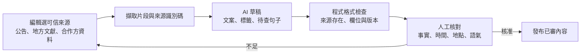

# AI 技術與工具｜用模型擴大內容供給，用規則維持可信流程

> 對應：應用的 AI 技術、工具與選用原因。
> 結論：AI 協助推薦理由、地方草稿、卡面與回顧；編輯負責事實和發布；叫車、固定款式與里程碑資格由可稽核的程式處理。
> 狀態：已有離線生成卡面；正式 AI 服務、線上推薦及實驗結果仍屬提案。

## 正文草稿

遊喜樂的 AI 解決兩個新增服務問題：一是持續製作具地方特色的內容與卡面，二是在有限的內容池中，提供符合使用者興趣、時間與移動條件的建議。文字模型協助整理來源與生成草稿，圖像模型製作可重用的插畫素材，推薦系統則根據已授權的資料挑選合適地方。使用者抵達後，系統從已審卡面組合當次日期、款式與紀念元素，讓長輩直接查看、保存及分享。

AI 輸出不直接變成產品事實。地方歷史、開放資訊與圖像先經人工檢查；推薦只能從上架地方庫選取，不能編造景點、車資或優惠。符合到訪條件即取得卡片，款式與里程碑資格由公開的伺服器規則處理，不交由語言模型自由判斷。

## 工具選用與分工

| 工作 | 建議工具／技術 | 選用原因 | 人工或程式負責的部分 |
|---|---|---|---|
| 地方文案 | Vertex AI 上的 Gemini Flash；以來源片段輔助生成 | 能處理結構化資料並產生草稿；以既有 Google Cloud 成本情境評估 | 編輯核對事實、出處、語氣與可到訪性 |
| 公告摘要、標籤 | Gemini Flash-Lite 級小模型 | 工作短、量較大，應以單位成本與錯誤率選型 | 格式驗證、類別白名單、例外轉人工 |
| 推薦候選 | 規則過濾與加權排序；必要時加文字嵌入（embedding） | 少量地方先保持可解釋；向量可協助語意匹配 | 距離、開放狀態與偏好限制優先於模型分數 |
| 推薦理由 | Flash-Lite＋結構化輸出；模板備援 | 將已有特徵轉成簡短理由，避免每次開頁都即時生成 | 檢查地點與理由是否有依據，失敗回模板 |
| 卡面圖片 | Imagen 為雲端候選；需要參考圖時評估 Gemini 圖像模型或現有 ControlNet 流程 | 依一般插畫與可辨認地標選不同流程 | 逐張看構圖、錯誤文字、主體、授權與風格 |
| 個人回顧 | 結構化摘要＋小模型；數字模板優先 | 文字敘事可個人化，但不必為每次開啟呼叫模型 | 里程與張數由程式算，日誌本人可改可刪 |
| 內容產線 | Cloud Run 工作程序、物件儲存、審稿台 | 將生成、重試、發布和 App 讀取分離 | 版本、成本、退稿原因、權限與回退 |

Google 的結構化輸出可約束回傳欄位與格式；格式符合 schema 不代表內容正確，仍需自行驗證。[官方文件](https://docs.cloud.google.com/vertex-ai/generative-ai/docs/multimodal/control-generated-output)（查閱 2026-09-29）

文字嵌入把文本轉為可比較的向量，可用於檢索與相似度；它不保證推薦符合移動條件，也不等同已訓練個人化模型。[官方文件](https://docs.cloud.google.com/vertex-ai/generative-ai/docs/embeddings/get-text-embeddings)（2026-09-29）

## 文案能不能請 AI 做？可以，但要拆開工序

編輯先決定「哪些地方值得寫、哪些來源可以引用」。AI 依提供的片段輸出三類內容：給使用者看的草稿、每句對應的 sourceId、資料不足的提醒。對不上來源的句子留空或移除，不要求模型補出一段看似完整的歷史。初期編審角色可由團隊或企業既有內容窗口兼任，不以新增專任人員為前提。

這是檢索增強生成（RAG）的輕量用法：先取得可用資料，再讓模型依資料寫作。小型內容庫可先用結構化表與人工選段，不必一開始部署大型向量服務。外部文本當作資料，不允許其中的指令改寫系統權限；模型沒有發布、下單或修改成本設定的工具權限。

| 工序 | AI 可協助 | 需要人處理 |
|---|---|---|
| 初始盤點 | 去重、初步分類、整理候選內容 | 選點、辨認虛構／過期素材、決定授權來源 |
| 草稿 | 摘要、改寫、不同字數版本 | 確認地方特色與實際可用性 |
| 事實查核 | 標示來源不足與前後矛盾 | 看原文，必要時聯繫場地方或實地確認 |
| 日常維護 | 找出過期活動與需要更新的欄位 | 核實營業／整修變動、批准更正 |

成本比較放在 [04 章](04-cost-and-resources.md)：省下的是起稿與整理時間，審稿、重寫、查證與圖片淘汰仍需計入。不宣稱 AI 能完全替代城市編輯。

## 圖片：已有 PoC 與正式候選怎麼區分

repo 已保存 DreamShaper 8＋ControlNet Canny 製作的部分卡面；產生器讀取授權照片，將輪廓資訊與圖生圖流程結合。這能約束構圖，但仍可能出錯，不能保證地標精確。依據：[生成腳本](../../app/tools/gen-postcards.py)、[參數清單](../../app/assets/postcards/index.json)、[素材說明](../../app/assets/postcards/README.md)。模型來源：[DreamShaper 8](https://huggingface.co/Lykon/dreamshaper-8)、[ControlNet Canny](https://huggingface.co/lllyasviel/control_v11p_sd15_canny)（查閱 2026-09-29）。

正式服務的工具比較如下；這是工程選擇，不表示已有盲評勝出者。

| 選項 | 優點 | 新增成本／限制 |
|---|---|---|
| 延續本機擴散模型產線 | 已有參數與成品，可控制版本和構圖 | 需算硬體、生成工時、依賴維護；開放權重不等於零成本 |
| Imagen 雲端文字生圖 | 依張數估價，適合批次候選 | 文字生圖不等於能精確重現指定建築；地標須另驗證 |
| 支援參考圖的雲端模型 | 可提供真實場景作輸入 | 輸入圖費、輸出規格與資料處理區域要另核對 |

[Google 圖像能力文件](https://docs.cloud.google.com/vertex-ai/generative-ai/docs/image/overview)與[定價](https://cloud.google.com/vertex-ai/generative-ai/pricing)（2026-09-29）用來核對各模型的輸入型態與成本，不用單一模型名稱概括所有能力。

基本款先生成並審核，節慶與紀念標記再用程式疊加。使用者取得的卡片來自已上架圖庫，再依當次規則形成成品。參考圖來源、模型版本、提示版本與發布簽核一併保存，撤架時能找到受影響的卡面。里程碑客製樣式可採相框或排版模板，不需為每次解鎖重新生圖。

## 推薦：先可解釋，再增加複雜度

1. 編輯限定候選池，排除過期、關閉或資料不足的地方。
2. 依使用者自選興趣、可用區域與已授權互動特徵排序；沒有偏好時用編輯精選。
3. 回傳 placeId、依據欄位、內容版本及有效時間。
4. 小模型只將實際依據轉成一句理由；不把未知興趣寫成已知，也不把粗略生活圈稱為住址。
5. 在觀測到穩定曝光／選擇資料後，再比較加權排序、向量相似或學習排序模型。資料少時先不自訓大型模型。

推薦可以提示使用者還沒看過的主題，但不以推測的付款意願改變收卡資格。款式和里程碑與推薦個人化分開；回訪次數、里程及圖鑑統計均由程式計算，不由模型生成。

## 品質驗證與停止條件

| 能力 | 如何驗 | 不能只看什麼 |
|---|---|---|
| 文案 | 相同來源比較 AI 草稿＋編輯與人工版本；記工時、退稿及無依據句子 | 只看生成速度或字數 |
| 卡面 | 比較地標可辨識、明顯錯誤、每款候選可用率與重生成輪數 | 只看漂亮或單張 API 價格 |
| 推薦 | 與編輯精選比較有用程度、查看／前往選擇，保留曝光分母 | 只看點擊，不看是否適合出行 |
| 回顧 | 對照模板，檢查數字、隱私與編輯需求 | 只看語氣像不像人 |

以上是評估方法提案，不宣稱已測得改善比例。先用固定測試案例保留來源、輸出與版本，再決定模型；模型更新後重跑相同案例。輸出不合格回到既有內容或模板，叫車可繼續使用。

雲端型號採配置管理，正式採購時核對可用模型 ID、區域、限額與條款。`asia-east1` 是部署候選，不代表每一個模型都能在台灣處理資料。成本來源與 token 假設集中於 04 章。
