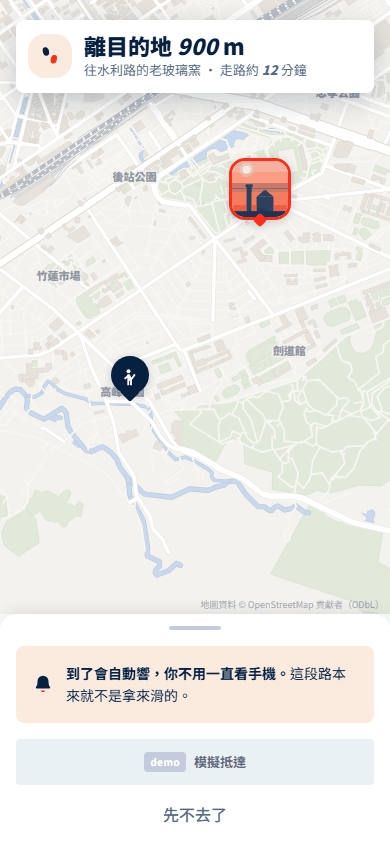
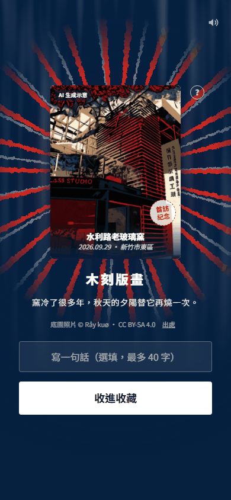
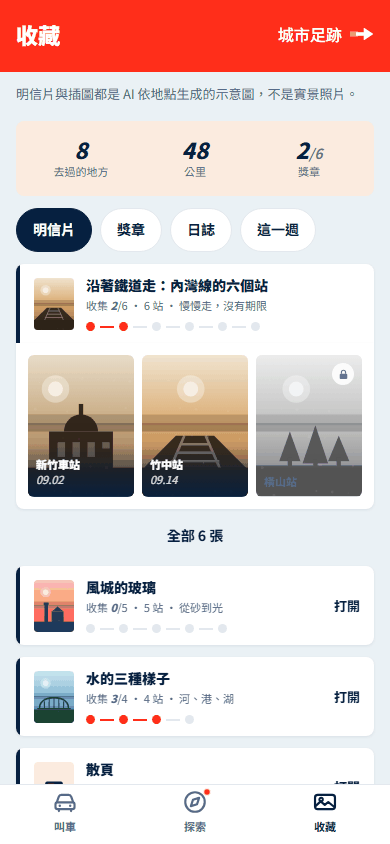
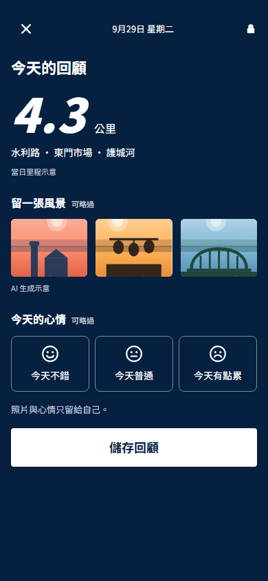

# 八、補充資料｜從一次出門，到一張留得住的城市記憶

> 本章把提案中的產品主張接回可檢查的來源：畫面證明目前原型能怎麼操作，程式文件說明規則如何落地，外部文獻只提供設計依據。原型不能替代真實派車、到訪辨識、使用者研究或營運數據。
>
> 外部研究與官方技術文件查閱日：2026-09-29。競賽資訊沿用 repo 既有保存紀錄；送件前仍應核對官方公告與附件是否更新。

## 1. 產品證據要回答的，是同一段生活如何一路走下去

遊喜樂的核心不是多放一個景點頁，而是把原本彼此斷開的五個時刻接成一段可回來的城市關係：先看見一個地方，選擇走路或搭 yoxi；抵達後收下一張屬於這次造訪的明信片；卡片進入收藏，去過的地方逐漸形成城市足跡；之後再把自己的照片與心情做成回憶卡。搭車在這段路徑中有清楚的商業位置，步行也保留完整價值。

這段敘事有三種不同強度的證據。第一種是「已可操作」：現有 HTML／PWA 原型可以走過探索、移動、抵達、收卡、收藏與製卡。第二種是「已寫成規則」：畫面、狀態、卡面與路由在程式中有共同來源，能由測試核對。第三種是「待驗證」：正式派車、可靠的到訪判定、個人化推薦、後端同步與長期使用效果都還不是現成能力，也不應由截圖推論。

| 產品主張 | 現有佐證 | 證據邊界 |
|---|---|---|
| 探索與叫車可以在同一個入口銜接 | `#/ride?mode=explore`、探索面板、`app/js/views/ride.js` | 是互動設計與前端原型；不是正式 yoxi App 已上線的功能 |
| 使用者可依距離選擇步行或 yoxi | `/going/:id`、行程模組、`APP.explore.collect` | 步行、叫車與抵達目前都是 demo 狀態；真實服務需企業行程與定位接點 |
| 抵達後一定有一張按規則生成的卡 | `explore-cards.js`、`explore-unlock.js`、`explore-face.js` | 規則與部分卡面已建；到訪防刷、內容權利與正式生成服務仍需驗證 |
| 卡片會累積成收藏與城市足跡 | `/album`、`/postcards`、`/footprint`、`APP.footprintPlace` | 統計來自示範狀態與公式，不是實際使用者成果 |
| 去過的地方可以再做成個人回憶卡 | `/lookback`、`app/js/views/album-memory.js` | 現行版本是本機模板與本機照片，保存在 localStorage，尚未接 AI 後端 |

完整的服務責任、資料流、正式 API 候選與分享邊界集中在[技術附錄](notes/technical-appendix.md)，本章不重複展開。

## 2. 五張畫面，連成一條可操作的產品路徑

以下圖片都直接引用工作樹中的 `app/assets/shots/`，並已於 2026-09-29 逐張檢視。它們證明現有原型的畫面與互動狀態，不證明真實位置、即時車資、正式派車或上線成效。

### 2.1 探索：先讓地方值得出發

探索不是從叫車流程外另開一座內容島。畫面在同一個主頁面板呈現今天的地方、距離、步行時間、「用 yoxi」與收藏線索；使用者先因地方產生興趣，再決定移動方式。對應程式是 `app/js/views/ride.js` 的探索模式，產品契約見 [App 架構](../../app/ARCHITECTURE.md)。畫面中的地點與距離是原型資料，不能當作地方史或即時位置的外部證據。

### 2.2 移動：近的地方走過去，遠的地方交給 yoxi

步行頁把注意力還給街道：保留路線、距離與抵達提示，不要求使用者一路盯著手機。搭車則沿用同一個地方與同一套收卡結果，由 `APP.ride.trip` 保存原型行程狀態。這能證明產品把兩種移動方式接到同一個目的地；地圖上的「模擬抵達」也清楚表示目前沒有用它主張真實定位驗證。

### 2.3 抵達：這一次來過，變成一張明信片

抵達後，地點、日期、移動方式與當期規則共同決定卡片樣式。現行規則沒有抽籤：同樣條件會得到同樣結果；`app/js/views/explore-cards.js` 提供判定，`explore-unlock.js` 畫抵達與收卡流程，`explore-face.js` 讓解鎖頁與收藏頁使用同一張卡面。圖片上的「AI 生成示意」與底圖出處是交付時應保留的誠實標示。

搭 yoxi 抵達時可呈現金框與同行紀念，但點數、門檻和出資方式仍是產品規則與商業假設，不能由 `unlock-ride.png` 推論企業已核准。正式版也需要伺服器端去重、到訪證據與版本紀錄，避免只相信手機端按鈕。

### 2.4 收藏：卡片不是終點，而是城市足跡的入口

收藏首頁把去過的地方整理成明信片、回憶卡、期間里程、獎章與城市足跡。`app/js/views/album.js` 讀取同一份到訪狀態；`APP.footprintPlace` 再把可辨識座標的卡片映射到足跡地圖。這種整理方式讓一次出門在之後仍有可看的內容，也讓「下次去哪裡」能從自己的空白處長出來。

畫面中的張數、公里與比例都來自 demo 狀態或公式。足跡目前只涵蓋底圖能辨識的地方，不能拿來宣稱真實城市覆蓋率；計算限制記在 [App 架構的地點正規化說明](../../app/ARCHITECTURE.md)。

### 2.5 回憶卡：讓使用者替自己的記憶加上一層意思

回憶卡從已造訪地點取模板，使用者可放入這台裝置上的照片並選一種心情，再保存成自己的卡。若今天沒有新足跡，畫面會明示改用最近去過的地方。這一步把制式明信片轉成個人敘事，也自然帶回「再去一次」的理由。

目前實作是本機構圖模板，照片先在裝置端縮圖，再與心情、構圖提示一併寫入 localStorage；它沒有上傳照片，也沒有呼叫 AI 生圖服務。程式入口是 `app/js/views/album-memory.js`，狀態契約見 [App 架構](../../app/ARCHITECTURE.md)，操作說明見 [App README](../../app/README.md)。因此這張圖能證明製卡互動與本機保存，不能作為 AI 後端、跨裝置同步或雲端相簿已建置的證據。

## 3. 程式碼如何支持這條敘事

本機 remote 指向 [Ricky610329/Yoxi_app_design](https://github.com/Ricky610329/Yoxi_app_design)。本次只核對 remote 設定，沒有以未登入狀態驗證公開可讀性；對外送件時應改用評審可讀的固定 branch 或 commit permalink，並與交付版本一致。

| 程式入口 | 可查到的證據 | 閱讀時要注意 |
|---|---|---|
| [專案 README](../../README.md) | 產品定位、三條主線與入口 | 是持續演進中的專案總覽 |
| [App README](../../app/README.md) | 開啟方式、demo 路徑、截圖對照與已知限制 | 明確說明派車、定位與狀態仍為模擬或本機資料 |
| [App 架構](../../app/ARCHITECTURE.md) | 路由、狀態、模組 API、公式與測試契約 | 描述現有 web app；不是正式 yoxi 行動端契約 |
| [探索與收卡規則](../../app/js/views/explore-cards.js) | 款式、節日、里程、回訪與收卡判定 | 固定規則可檢查；正式資格仍需後端核發 |
| [抵達畫面](../../app/js/views/explore-unlock.js) | 抵達、翻卡、收進收藏與搭車樣式 | demo 按鈕不能替代真實到訪證據 |
| [卡面共同來源](../../app/js/views/explore-face.js) | 生成成品、授權照片、濾鏡與替代插圖的優先順序 | 部分地點仍使用照片加濾鏡或插圖替代 |
| [收藏與足跡](../../app/js/views/album.js) | 明信片、統計、足跡與回顧入口 | 數字是狀態與公式的輸出 |
| [回憶卡](../../app/js/views/album-memory.js) | 本機照片、心情、模板與保存 | 現行版本沒有 AI 請求或雲端同步 |
| [卡面產生腳本](../../app/tools/gen-postcards.py) 與 [生成參數](../../app/assets/postcards/index.json) | 現有示意卡的模型、種子、提示與參考照片 | 是素材製作可追溯性；不同環境未必位元級重現 |
| [App 測試說明](../../app/tests/README.md) | 路由、DOM、公式、互動與瀏覽器驗收方法 | 測試通過只表示實作符合契約，不等於市場效果 |
| [畫面總登記表](../../prototype/js/catalog.js) | 原型流程、變體、願景稿與概念稿的狀態 | 引用時要區分 `built`、`planned` 與概念畫面 |

現有 repo 也保留家人回話與 LINE 造型的歷史 mock。它們不列入上述證據鏈，也不能用來主張已串接 LINE、已建立子女帳號，或能取得收件、已讀與私聊內容。

## 4. 外部文獻只支持設計方向，不替產品效果背書

Ryan 與 Deci 對自我決定理論的整理，把自主、能力感與關係連結視為理解動機的重要構面。本案據此提出一個設計推論：讓人自己選地方、選步行或搭車，並看見自己的收藏逐步形成，可能比只增加外部獎勵更接近長期的個人意義。這篇研究沒有測試 yoxi、城市探索或本提案，也沒有提供可直接套用的留存百分比。[Ryan & Deci, 2000，American Psychologist](https://www.selfdeterminationtheory.org/SDT/documents/2000_RyanDeci_SDT.pdf)

Looyestyn 等人的系統性回顧納入十五篇有對照條件的線上方案研究。結果顯示部分遊戲化設計與較高參與相關，但研究場景、組件與品質差異很大，長期結果也較不一致。對遊喜樂最合理的用法，是把明信片、獎章與足跡當成需要試點檢驗的設計，而不是先宣稱它們會帶來多少開啟或搭車。[Looyestyn et al., 2017，PLOS ONE](https://journals.plos.org/plosone/article?id=10.1371/journal.pone.0173403)

因此，這兩篇文獻支持「為什麼值得測」，不支持「效果已經發生」。成效指標、觀測窗與停損條件以 [KPI 文件](../docs/kpi.md) 為準。

## 5. 官方技術文件：用來界定可行路徑與限制

下列官方入口於 2026-09-29 可開啟。它們說明候選技術具備哪些能力，也同時提醒整合限制；並不表示現有 yoxi App 已採用這些元件。架構選擇與企業接法仍以實際技術現況為準，費率與用量試算集中在 [成本與資源](04-cost-and-resources.md)，本章不另抄單價。

| 類別 | 官方文件 | 可支持的範圍 |
|---|---|---|
| 手機 demo 與既有 App 評估 | [Expo development builds](https://docs.expo.dev/develop/development-builds/introduction/)、[Expo brownfield](https://docs.expo.dev/brownfield/overview/) | 可製作含原生依賴的測試版本；brownfield 文件明列仍有 alpha 支援與相容限制 |
| 定位與圖片移交 | [Expo Location](https://docs.expo.dev/versions/latest/sdk/location/)、[Expo Sharing](https://docs.expo.dev/versions/latest/sdk/sharing/)、[React Native Share](https://reactnative.dev/docs/share) | 可讀裝置定位並開啟系統分享流程；定位值不是充分到訪證據，分享 API 回傳也不能證明對方收件或閱讀 |
| API 與背景工作 | [Cloud Run](https://docs.cloud.google.com/run/docs/overview/what-is-cloud-run)、[FastAPI](https://fastapi.tiangolo.com/) | 是部署與 API 實作候選；本案正式服務尚未建置 |
| AI 內容管線 | [結構化輸出](https://docs.cloud.google.com/vertex-ai/generative-ai/docs/multimodal/control-generated-output)、[文字嵌入](https://docs.cloud.google.com/vertex-ai/generative-ai/docs/embeddings/get-text-embeddings)、[圖像生成與編輯](https://docs.cloud.google.com/vertex-ai/generative-ai/docs/image/overview) | 可評估格式約束、文本檢索與圖像能力；格式正確不等於地方內容正確，模型、區域與權利條件需逐案確認 |

現有示意卡的素材工具另有 [DreamShaper 8 模型頁](https://huggingface.co/Lykon/dreamshaper-8) 與 [ControlNet Canny 模型頁](https://huggingface.co/lllyasviel/control_v11p_sd15_canny) 可追溯。這只能說明現有素材如何產生，不能自動延伸成正式商用權利判定。

## 6. 競賽、資料、商業與素材來源

| 來源 | 在本提案中支持什麼 | 仍需補什麼 |
|---|---|---|
| [競賽官方資料整理](../docs/competition.md) | 題目目標、交付要求與既有來源紀錄 | 官方入口與附件送件前再核對；本次沒有宣稱已重新取得附件 |
| [產品工作簡報](../BRIEF.md) | 產品定位、數字紀律、AI 角色與敘事基準 | 版本仍會隨送件內容收斂 |
| [資料應用提案](../docs/data-plan.md) | 地方、推薦、到訪與分析欄位候選 | 不是已取得的企業資料字典 |
| [內容與商業估算](../docs/business.md) | 地方量、更新量、編輯工時與商業假設 | 不是公司現行成本或營運承諾 |
| [AI 架構與試算](../docs/ai-architecture.md) | 內容管線、模型候選、用量與歷史成本基準 | 正式模型、區域、採購與治理仍待確認 |
| [Roadmap](../docs/roadmap.md) | 分期範圍、依賴與守門指標 | 日期與資源需由企業排程校準 |
| [競品比較](../docs/competitive.md) | 比較維度與差異化假設 | 產品功能與方案會變，送件前應重查 |

競賽公開入口沿用既有紀錄：[競賽官網](https://ht-hackathon.tw/tw/home)、[題目附件](https://cdn.bountyhunter.co/file-presign/d382a46c-1ca6-4363-8e03-1481260d5c9f.pdf)。若連結失效或內容更新，以主辦方最新公告為準。

照片作者、授權與出處以 [credits.js](../../prototype/assets/photos/credits.js) 及 [卡面素材說明](../../app/assets/postcards/README.md) 為依據；裁切、改作與分享版本仍需逐張核對。地圖使用 repo 內的 OpenStreetMap 資料並保留署名，開放資料授權不等於所有圖磚、SDK 或營運服務都免費。企業提供、未授權公開的解題資料不放進 repo；示範欄位使用合成案例。AI 卡面、模擬行程、示意地點與尚未串接的功能都應在畫面或講稿中清楚標示。

## 7. 評審可以據此檢查什麼

評審可從五張畫面順著實際路徑檢查產品是否連貫，再由程式入口核對畫面是否共用同一份規則與狀態；也可由生成參數、照片授權與官方文件追查素材和技術來源。這些材料足以證明團隊已把產品概念做成可操作、可讀、可測的原型。

還不能由這些材料下結論的，包括正式派車可用性、真實到訪準確率、AI 推薦品質、跨裝置資料一致性、內容營運成本，以及開啟率、回訪、叫車轉換或收入改善。這些問題應交給試點、企業資料與預先定義的指標回答，而不是由 demo 數字或畫面觀感代替。
