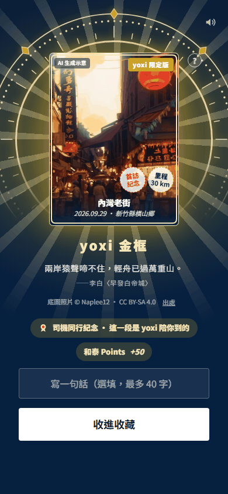

# 八、補充資料｜參考來源、程式文件與原型佐證

> 用途：供簡報附錄引用；每個來源說明能支持哪一個主張。
> 查閱日：技術與研究來源於 2026-09-29 核對；競賽附件以 repo 既有保存紀錄為準。
> 狀態：原型與圖片可證明設計及部分素材製作，不能證明正式派車、真實家庭互動或留存成效。

## 1. 可用於正文的補充說明

本方案提供可操作的 HTML／PWA 原型、畫面素材、收卡規則程式與 AI 圖像生成參數，供評審檢視從探索到出行、收藏與分享的體驗。正式服務架構以企業既有能力與新增模組分工呈現，並說明來回候車、家庭回應與里程碑樣式需要補齊的接點。

AI 工具能力與單價取自供應商官方文件；使用動機研究保留為背景資料，不另替換團隊原有論述，也不宣稱本案已有留存改善。人力與使用量明標假設，後續以試點數據修正。

## 2. 競賽與內部依據

| 資料 | 用途 | 版本／限制 |
|---|---|---|
| [競賽官方資料整理](../docs/competition.md) | 題目目標、要求、章節及資料使用邊界 | 檔內保存 2026-09-21 來源紀錄；本次官方網站／附件未能重新取得，不宣稱重新驗證時程 |
| [產品工作簡報](../BRIEF.md) | 產品立場、數字與內容原則 | 本次僅讀；新增里程碑樣式尚未替換原產品基準 |
| [內容與商業估算](../docs/business.md) | 初始地方量、更新量與編輯工時假設 | 04 章取其內容成本，不引用為平台全成本 |
| [既有 AI 架構與試算](../docs/ai-architecture.md) | 歷史單位成本及較大圖庫情境 | 部分數字為 2026-09-23 基準；與現行五款圖庫分開 |
| [資料應用提案](../docs/data-plan.md) | 資料候選、推薦特徵與抵達驗證 | 不是已收到的企業資料字典 |

官方公開入口：[競賽官網](https://ht-hackathon.tw/tw/home)、[題目附件](https://cdn.bountyhunter.co/file-presign/d382a46c-1ca6-4363-8e03-1481260d5c9f.pdf)。這兩個連結沿用既有資料整理；送件時再確認能開啟及是否有新版。

## 3. 官方技術與成本來源

下列來源均查閱於 2026-09-29；服務價格與支援範圍仍需在正式採購時重查。

| 來源 | 支持的主張 | 不用它推論什麼 |
|---|---|---|
| [Expo development builds](https://docs.expo.dev/develop/development-builds/introduction/) | development build 是測試自訂原生依賴的方式 | 不等於 yoxi 的 SDK 已相容 |
| [Expo Router](https://docs.expo.dev/router/introduction/) | 跨平台檔案路由候選 | 不代表現有 HTML 畫面可直接轉成原生畫面 |
| [Expo 既有原生 App 整合](https://docs.expo.dev/brownfield/overview/) | 可評估模組整合，官方標示 alpha 支援限制 | 不承諾正式 App 可以無改動嵌入 |
| [Expo Location](https://docs.expo.dev/versions/latest/sdk/location/) | 定位能力、權限與平台限制 | 定位值不等於到訪或防刷的充分證據 |
| [Expo SecureStore](https://docs.expo.dev/versions/latest/sdk/securestore/) | 裝置端敏感小型資料儲存候選 | 不是雲端秘密管理或完整權限系統 |
| [Cloud Run](https://docs.cloud.google.com/run/docs/overview/what-is-cloud-run) | API 與背景工作的部署候選 | 不表示已有正式服務或可用率實測 |
| [結構化輸出](https://docs.cloud.google.com/vertex-ai/generative-ai/docs/multimodal/control-generated-output) | 約束模型輸出格式與欄位 | 結構正確不等於事實正確 |
| [文字嵌入](https://docs.cloud.google.com/vertex-ai/generative-ai/docs/embeddings/get-text-embeddings) | 地方文本相似度與檢索 | 不直接證明個人化推薦品質 |
| [Google 圖像能力](https://docs.cloud.google.com/vertex-ai/generative-ai/docs/image/overview) | 依模型確認生成與編輯能力 | 不假設所有型號都支援參考圖 |
| [生成式 AI 定價](https://cloud.google.com/vertex-ai/generative-ai/pricing) | 04 章文字與圖片 API 單價 | 不包含人工、儲存、傳輸或獎品 |
| [Cloud Run 定價](https://cloud.google.com/run/pricing) | 依 CPU、記憶體與執行型態試算 | 不能直接套別區域範例當台灣帳單 |
| [DreamShaper 8 模型頁](https://huggingface.co/Lykon/dreamshaper-8) | 現有生成工具使用的模型來源 | 不表示所有圖片內容已被模型供應商核可 |
| [ControlNet Canny 模型頁](https://huggingface.co/lllyasviel/control_v11p_sd15_canny) | 現有輪廓控制模型的來源 | 不保證建築圖像與實景完全一致 |
| [LINE LIFF 分享介面](https://developers.line.biz/en/reference/liff/#share-target-picker) | 可分享給使用者選定的好友／群組，回報分享結果 | 不提供收件人數，不等於可讀家人私聊 |
| [LINE 接收訊息事件](https://developers.line.biz/en/docs/messaging-api/receiving-messages/) | 核對官方帳號可接收的事件 | 不代表分享後的私人聊天可回讀；子女互動設在自有頁 |

Google 部分頁面已使用 Gemini Enterprise Agent Platform 名稱；本稿沿用 repo 的 Vertex AI 用語，實際模型 ID、區域與 SKU 以正式部署設定為準。

## 4. 使用動機參考文獻

1. **Ryan, R. M., & Deci, E. L.（2000）**。*Self-Determination Theory and the Facilitation of Intrinsic Motivation, Social Development, and Well-Being.* American Psychologist, 55(1), 68–78。[作者研究網站全文](https://www.selfdeterminationtheory.org/SDT/documents/2000_RyanDeci_SDT.pdf)。用途：自主、能力感與關係連結的背景依據，可供團隊原有使用動機論述參考。
2. **Looyestyn, J., et al.（2017）**。*Does gamification increase engagement with online programs? A systematic review.* PLOS ONE, 12(3), e0173403。[期刊原文](https://journals.plos.org/plosone/article?id=10.1371/journal.pone.0173403)。用途：支持將遊戲化視為值得測試的參與設計，也提醒長期效果需另驗證。

兩篇均不能直接證明遊喜樂能增加多少留存或出行。主方案的接送、保證收卡與家人互動仍需實際驗證。

## 5. GitHub 與程式碼文件

Repo remote：[Ricky610329/Yoxi_app_design](https://github.com/Ricky610329/Yoxi_app_design)。網址依本機 `git remote` 核對；本次未驗證未登入者可讀性，也未推送新文件。

| 入口 | 可查看的內容 | 證據邊界 |
|---|---|---|
| [專案 README](../../README.md) | 專案入口與現況介紹 | 正在迭代，交件應固定版本 |
| [App 使用說明](../../app/README.md) | 如何開啟可操作的 web app | 是體驗原型，不是正式派車客戶端 |
| [App 架構契約](../../app/ARCHITECTURE.md) | 路由、模組、狀態、測試規則 | 描述現有 web app，非尚未建置的 Expo App |
| [Catalog](../../prototype/js/catalog.js) | 畫面、流程、變體與產品演進登記 | 概念與已建畫面需看 state 區分 |
| [卡片規則](../../app/js/views/explore-cards.js) | 現有款式、回訪與紀念規則 | 固定規則；客製里程碑樣式不是現有能力 |
| [卡面生成腳本](../../app/tools/gen-postcards.py) | 現有圖像產生流程 | 執行需另外準備模型與環境，不宜直接在評審機器臨時生成 |
| [生成參數](../../app/assets/postcards/index.json) | 提示、種子、模型與參考照片檔名 | 可追溯製作設定；不同環境未必位元級重現 |
| [卡面素材說明](../../app/assets/postcards/README.md) | 已有圖像範圍與示意標示 | 部分尚未生成的地方有替代畫面 |
| [App 測試說明](../../app/tests/README.md) | 驗收方法與執行方式 | 測試通過不等於真實營運成效 |
| [本次流程稿](02-flow-design.md) | 接送、收卡、分享、家人回應與里程碑 | 正式接點與新增樣式仍是提案 |

如果提供評審 GitHub 連結，交件時再指定可讀分支或 commit permalink。僅有這次本機 commit 不能保證遠端可讀，不在附錄捏造已部署 demo 網址。

## 6. 原型與模擬畫面

本機入口：[可操作 App](../../app/index.html)、[原型總覽](../../prototype/index.html)、[設計提案](../../prototype/proposal.html)。一般展示先依 App README 開啟；圖像及版面會隨開發變動，正式交件另存選定版本。

### 探索與出行入口

來源：`app/assets/shots/ride-cards.png`。可展示探索內容與叫車入口的相鄰關係。畫面中的「水利路老玻璃窯」等部分地點是原型情境素材，不用此畫面證明真實地方史、即時位置或實際報價；地圖署名保留在畫面上。

### 抵達收卡示意

來源：`app/assets/shots/unlock-ride.png`。可展示 AI 卡面、金框、首訪與里程標記，以及收下操作。畫面已有 AI 示意與照片署名；點數為原型規則，不代表企業已核准發放。

### 個人收藏

來源：`app/assets/shots/album.png`。可展示收藏與回顧如何累積成個人內容；其中張數與里程是示範狀態，不是使用者研究數據。

本次看過上述三張工作樹圖片；不改圖、不重拍正在調整的 App。此 Markdown 使用相對連結，檔案更新時畫面也會更新，因此交件 PDF 應使用固定版本的素材。

## 7. 素材來源與交件時的誠實標示

- 照片作者、授權與出處以 [credits.js](../../prototype/assets/photos/credits.js) 與 [卡面說明](../../app/assets/postcards/README.md) 為依據；裁切、改作及分享版本均需核對對應素材條件。
- 地圖沿用 repo 的 OpenStreetMap 資料及署名；資料來源、圖磚服務與行動端 SDK 是不同項目，不能把資料開放等同所有服務免費。
- AI 卡面寫明「AI 生成示意」；模擬行程、示意地點與未串接的分享互動需能辨識。
- 企業寄送的解題資料不放入 repo 或對外附錄；使用合成案例說明欄位與流程。
- 04 章成本例是可重算的設計推演；不要標為實際上線數據或引用成企業官方方案。
