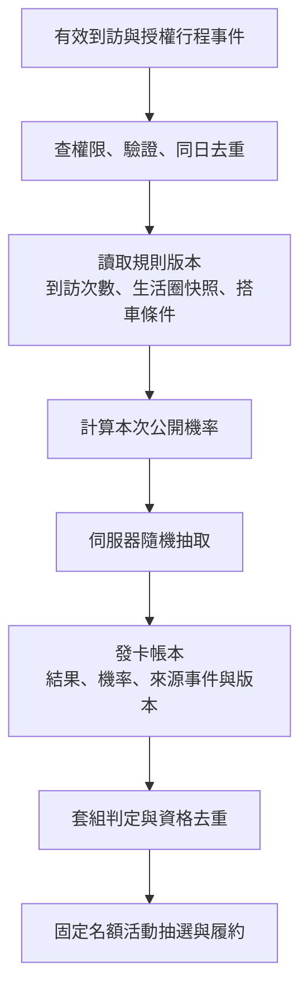

# 早期討論備存｜機率卡與套組抽獎（未納入主方案）

> **以後續對齊為準**：使用者最後指定主流程為接送、探索、保證取得固定規則明信片、LINE 家人互動與圖鑑里程碑。以下保留早期提問的推演，不是本次正文、採用決策或實作要求；也不應引用其中機率／獎池作主方案估算。

> 分享邊界補註：本文的家人互動僅指 LINE 外部情境；目前主方案不建立自有回應頁、不蒐集子女私聊。現行定義以 [流程稿](../02-flow-design.md) 為準。

> 狀態：產品討論稿。基本收卡已有 PoC；回訪機率、距離／搭車加成、套組抽獎均為本次新增候選，尚未實作。
> 核心問題：第一次因卡片而來，之後有什麼理由再次開啟、再次造訪，並在需要時選擇 yoxi？
> 數字：本章機率、距離、套組張數與實驗期間都是設計示例，沒有使用者成效資料支持，不能當成定案參數。

## 1. 當時的概念敘述（不放入本次正文）

遊喜樂將使用動機分成「今天有用」「回來有變化」及「累積後有意義」。第一次開啟時，使用者看到附近可以去的地方與可收藏的卡片；後續依生活圈、到訪紀錄與興趣，持續發現新的地方故事。卡片記錄在哪裡、何時與如何到訪，讓原本一次性的移動逐步形成自己的城市收藏。

在基本收藏被使用者接受後，可加入回訪成長與主題套組。附近地點適合順路多次造訪，累積取得特別卡的機會；較遠的地方則兼具週末探索與交通需求，使用者可經多次到訪累積，或在原本需要出行時透過 yoxi 搭乘加成。之後再與在地場館或商家合作，讓集齊套組的人取得活動抽獎資格，形成內容、出行與合作的連結。

這些設計的價值要由持續使用與增量出行驗證。若只有獎品活動期間有人開啟，活動停止就離開，代表產品還未形成穩定的日常價值。

## 2. 什麼理由可能讓人常常回來

| 層次 | 使用者可能在意的事 | 產品提供什麼 | 需要驗證的問題 |
|---|---|---|---|
| 當下實用 | 「今天附近有什麼適合我的地方？」 | 少量、有理由的地方建議，交通與開放資訊 | 不想收卡的人是否仍覺得有用？ |
| 內容新鮮 | 「這個地方今天有什麼不同？」 | 地方故事、季節畫風、更新後的內容 | 有變化的內容是否值得再看，而非只換顏色？ |
| 個人積累 | 「這是我真的去過的城市。」 | 到訪紀錄、首訪／里程紀念、個人回顧 | 沒有活動獎品時，是否仍回來看收藏？ |
| 可見進展 | 「這組卡片已經收了幾張。」 | 主題套組、下一個合理可去的地方 | 規則是否易懂，是否真的引發想去的意願？ |
| 回訪變化 | 「我常來的地方也可能有新卡。」 | 公開的回訪機率加成 | 重複取得是否有趣，或讓人覺得白跑？ |
| 關係連結 | 「把這次出門留下的卡給家人看。」 | 自選分享與回應 | 是否產生有意義的交流，而非只為分享拿獎？ |
| 合作回饋 | 「這組收藏能參加我有興趣的活動。」 | 場館、展覽、地方店家的抽獎或體驗 | 獎品能否貼近地方與出行，而非任意贈品？ |

不把「每天使用」等同「每天搭車」。沒有出門時也能看推薦、整理收藏或回顧；真正有移動需求時再銜接叫車。通知只提醒有內容價值的事情，偏好可關，收藏不因某天沒有開啟而退回。

## 3. 研究能支持什麼

Ryan 與 Deci 的自我決定理論指出，自主、能力感與關係連結是理解動機的重要因素。本案據此提出設計推論：讓使用者自己選地方與交通方式、看見真實累積、分享自己想分享的內容，可能比只增加獎品更有助於形成個人意義。這不是該研究已驗證 yoxi 的留存效果。[Ryan & Deci, 2000](https://www.selfdeterminationtheory.org/SDT/documents/2000_RyanDeci_SDT.pdf)

Looyestyn 等人的系統性回顧發現，遊戲化在部分線上服務研究中與較高參與有關，但長期效果與不同場景仍需更嚴謹驗證。因此卡片、套組與抽獎可以作為實驗方向，不能從其他場景直接搬一個留存提升百分比。[Looyestyn et al., 2017](https://journals.plos.org/plosone/article?id=10.1371/journal.pone.0173403)

上述文獻查閱於 2026-09-29；距離加成與搭車加成是本團隊的新假設，文獻沒有證明本章的數值配置有效。

## 4. 分階段演進

| 階段 | 機制 | 先回答什麼 | 再增加什麼 |
|---|---|---|---|
| A 基本收藏 | 有效到訪即可保留當次基本卡，款式有理由 | 卡片與地方內容本身值不值得看？ | 不先增加隨機與活動獎池 |
| B 回訪特別卡 | 基本卡照常收；另有公開機率取得特別款 | 是否提高自願回訪，又不讓未中卡者挫折？ | 測回訪次數及生活圈距離 |
| C 主題套組 | 相近地方或相同主題形成一組，顯示收集 n/m | 能否引導有意義的探索？ | 先給收藏展示或確定的小回饋 |
| D 合作抽獎 | 符合套組條件者獲一次活動資格 | 能否帶來持續使用或增量商機？ | 獎池、履約、企業活動審核與預算 |

初期 demo 演 A，提案交代 B–D 的架構與成本；不必為了畫完整願景，在競賽前把所有機制建成。

## 5. 回訪、距離與搭車如何影響機率

### 5.1 把「好的卡」定義清楚

本稿以「特別卡」指圖案或收藏樣式不同的數位卡，不賦予現金價值，也不建立交易市場。基本卡仍保留出行記憶；特別卡是額外變化。若同一次符合條件，先收基本卡，再判定是否加發特別款，避免造訪後什麼都沒留下。

使用者提出的方向可以寫成兩條規則：**生活圈附近的地方，透過自然回訪較快累積機會；較遠的地方，以更多回訪或搭 yoxi 的加成取得相近機會。** 這讓鄰里與跨區探索有不同節奏，但不把付費搭車設為唯一取得路徑。

### 5.2 可計算的第一個討論模型

以下僅用來推敲體感，不是建議直接上線的機率表。

```text
n = 同一使用者在同一地方的有效到訪次數，含本次，n >= 1
d = 該地方到使用者自選生活圈代表點的距離，單位 km
r = 本次是否有經驗證、符合規則的 yoxi 行程；有為 1，否為 0

g(d) = 1 / (1 + d / 3)
p(n,d,r) = min(0.35, 0.05 + 0.03 × (n-1) × g(d) + 0.10 × r)
```

這裡 5% 是起始機率、回訪係數為 3 個百分點、搭車加成 10 個百分點、上限 35%，距離尺度為 3 km；全部是假設。這個 3 km 是機率模型的獨立參數，不自動沿用原型的步行門檻。

到訪數不要求連續、不因漏一天歸零；示例採同一地方同一日最多一次有效抽取，反覆重新整理不增加次數。機率隨有效到訪成長，取得特別卡後也不暗中歸零；若未來改成另一種規則，需公開新版本。

生活圈採使用者自選粗略區域，避免要求住址。若未提供，保留基本收卡，特別卡可採公開的中性距離級別；中性值與可更換生活圈的頻率仍待測試，不先默默推測住家。

| 有效到訪次數 | 附近 1 km、無搭車 | 遠處 15 km、無搭車 | 遠處 15 km、本次搭 yoxi |
|---:|---:|---:|---:|
| 1 | 5.00% | 5.00% | 15.00% |
| 3 | 9.50% | 6.00% | 16.00% |
| 5 | 14.00% | 7.00% | 17.00% |
| 10 | 25.25% | 9.50% | 19.50% |

以上為**本次**機率。不能把第五次 14% 寫成前五次至少拿到一次的機率，也不能說「搭車必得特別卡」。款式理由應顯示本次適用條件與加成；不以模型逐人秘密調整。

### 5.3 累積機率揭示的取捨

若每次抽取獨立，且前五次的距離與搭乘方式固定，至少取得一張特別卡的機率為：

```text
P(前 k 次至少一張) = 1 - ∏[i=1..k] (1 - p(i,d,r))
```

依上述示例，前五次附近不搭車約 **39.48%**，遠處不搭車約 **26.62%**，遠處五次皆搭 yoxi 約 **58.19%**。這些是公式結果，不是使用者實測，也不是五張不同特別卡的機率。

一個值得正面討論的問題：附近第五次的單次機率是 14%，遠處不搭車要到第十九次才同樣為 14%。這確實表現「靠多次前往也能累積」，但跨區造訪十九次可能很不切實際。提案不能只寫搭車誘因而忽略這個負擔。

可比較三種調整：縮小距離級別的落差；讓主題套組有生活圈內替代地點；保留純隨機款，同時提供回訪紀念的確定回饋。這些各有取捨，應先做小型體驗測試與機率模擬，觀察等待分布與未取得者比例再定案。

## 6. 同一張一直重複怎麼辦

| 做法 | 使用價值 | 代價 |
|---|---|---|
| 每次保留當次日期與短句 | 重複地方仍有個人記憶 | 光換日期可能不夠，需測使用者是否在意 |
| 特別款優先從尚未持有者選 | 降低集套組卡住的機會 | 需公開卡池及條件機率，重估套組速度 |
| 重複款轉成紀念印記或替代收藏資格 | 有明確的累積用途 | 新增規則、資料與經濟平衡，不宜第一版全加 |
| 基本套組不要求特別款 | 一般到訪也能參與合作活動 | 特別卡的價值需回到圖像與收藏意義 |

建議第一版機率實驗只加一種特別款，先量是否願意回訪；不要同時放大量稀有等級、多種兌換幣與複雜卡池。特殊卡的機率與現有搭車金框是不同概念，正式命名應能一眼區分。

## 7. 集齊一個 set 後可以抽什麼

「套組」是有城市意義的一組卡，例如文化建築、水岸散步、鐵道沿線或合作展覽。AI 可協助提出主題，編輯核對地點、交通可行性與內容關聯後上架。

一個可討論的活動示例：同一地區四個指定或等價替代地點的基本卡，組成一套；集齊後取得該活動一期一次的抽獎資格，卡片仍留在收藏。四張、一次與一期都是示例，需由活動規則定案。

| 設計決定 | 候選方式與建議 |
|---|---|
| 抽獎資格綁哪種卡 | 先用基本卡；若綁稀有卡，會出現「先抽中卡，再抽獎品」兩層不確定性，需額外測試 |
| 獎品內容 | 在地體驗、展覽門票、合作店家商品、出行折抵等；先確認供應與成本 |
| 同一人重複集齊 | 不直接無限增加序號；每人每套每活動的資格規則先公開 |
| 不搭車的人 | 可由步行、其他交通與有效到訪收基本卡；搭車加成主要先留在特別卡體驗 |
| 住得遠或內容少的區域 | 提供等價地方或主題選擇，避免只有某些生活圈容易參與 |
| 活動結束後 | 收藏仍保留，清楚區分長期收藏與當期抽獎資格；下一期規則不追溯剝奪舊卡 |

固定名額的活動例：2,000 個合格序號中，等機率、無放回選 20 個中獎序號，每個序號中獎率為 1%。若一人可持多個序號，個人的中獎率不等於 1%；若限制一人最多中一次並重新抽選，還需重新定義抽法。以上皆是假設，活動條款不能只寫模糊的「有機會中獎」。

獎品不是 AI 成本；還有採購、履約、客服、稅務與活動系統投入。主方案的 [04 章](../04-cost-and-resources.md) 不納入本備存機制的獎池。若未來重新討論，抽獎資格與付費行程的關係、參與條件及企業活動規範需另外確認，本稿不作合法性結論。

## 8. 系統如何讓規則可核對



發卡與資格核發在可回復的交易中處理。同一 visitId 重試只回原結果，手機不能重抽；伺服器使用合適的隨機來源並保存稽核紀錄，不將未來抽取狀態暴露給前端。分析記錄規則版本、當次機率、分組結果及延遲，監控重複核發與區域差異。

AI 只做卡面、文案、候選套組與推薦。它不決定某位使用者「快流失所以比較容易中」，也不因付費能力推論而修改機率；公開規則的可信度比短期刺激更重要。

## 9. 怎麼知道不是只熱鬧一週

建議逐步實驗，保留基本卡組作比較；不要一次加入所有機制，否則不知道效果來自哪裡。

| 假設 | 實驗方式 | 主要觀察 |
|---|---|---|
| 卡片本身帶來持續價值 | 同內容下比較基本資訊與加入收藏的版本 | 非叫車日主動開啟、收藏查看、後續回訪 |
| 回訪機率提高探索 | 在願意參與的群體中比較固定規則與公開機率 | 有效到訪、未中者留存、規則理解及挫折感 |
| 距離設計符合生活 | 依生活圈密度與距離分層分析 | 近／遠取得分布、偏遠區域是否明顯不利 |
| 搭車加成帶來增量出行 | 隨機分組並保留曝光與行程歸因 | 真實結束的行程差異，而非只看叫車按鈕點擊 |
| 套組活動留下長期使用者 | 活動期間與活動後追蹤，保持對照組 | 活動後主動開啟、地方互動與內容成本 |

可先規劃 4–8 週觀察（假設），但樣本數與檢定方式需依基準使用率及可偵測效果另定，不保證這個期間就足以證明留存。明確區分「打開看內容」「有效到訪」「付費行程」，三者不可互相代替。

每位參與者的增量貢獻，應以增量行程毛利與可確認的合作收入，扣除內容、AI、獎品及履約的增量成本。不能把車資全額當平台收益，也不能把所有探索後發生的叫車都歸因給卡片。

先讓使用者說得出「我今天打開它是想看什麼」，再判斷要不要增加抽卡與抽獎。若靠更高獎池才維持開啟，就應回頭改善地方內容與實用性。
