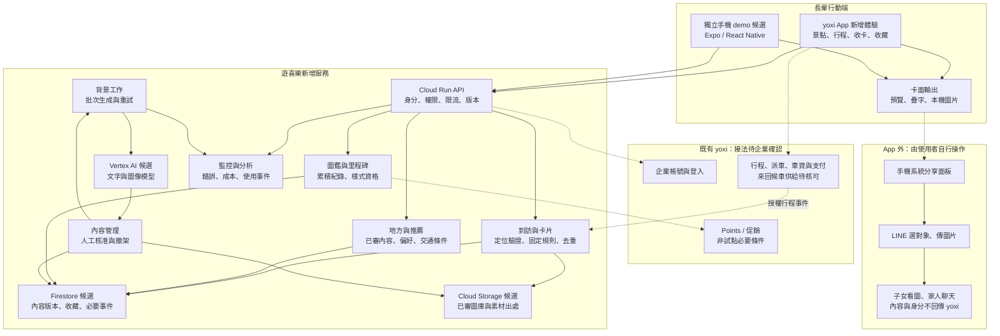
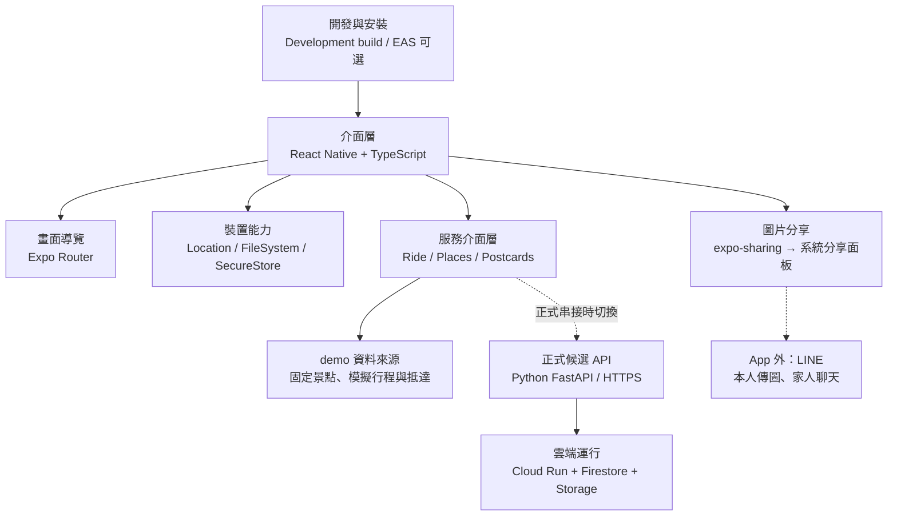
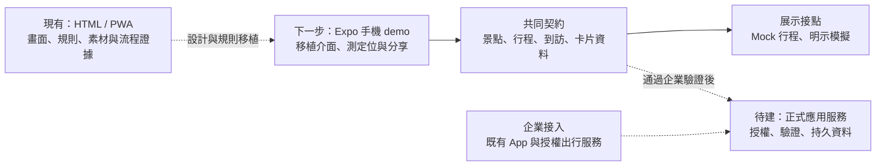
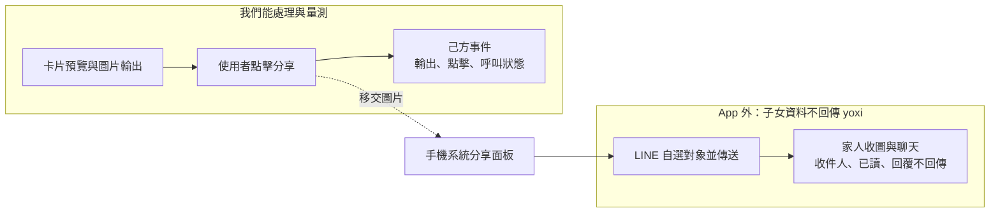
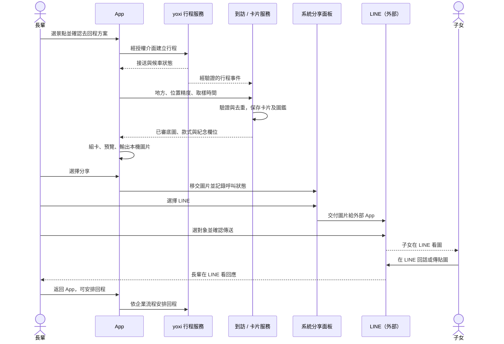

# 技術附錄｜服務接點與實作候選

本附錄供工程評估使用。正文先交代探索、出行與收藏如何連成體驗；以下再展開候選部署、裝置接點與例外處理。所有雲端 API 與 Expo 接入均為提案，現有 HTML／PWA 是可操作的流程原型。

## 1. 新增服務與既有 yoxi 的接點

方塊代表職責，初期可由一個模組化 API 與背景工作承接。帳號、行程、支付與回饋沿用企業授權服務；地方內容、到訪與收藏由新增模組管理。圖以長輩使用情境展開裝置端，不代表服務限定長輩使用。里程碑客製樣式與 Points 介接屬延伸候選，核心試點先沿用收藏與獎章。

## 2. 獨立手機 demo 的候選技術棧

Expo／React Native／TypeScript 用於評估手機 UI、前景定位、圖片輸出與實機操作。是否採用取決於展示需求與團隊能力；既有 PWA 可持續承擔流程測試。正式 yoxi App 的介接方式由企業技術現況決定。

## 3. 從原型到正式服務的交付選項

圖中的 Expo 是可選的手機驗證階段。共同資料契約可分別接模擬資料與正式 API；正式接入需重新驗證帳號權限、行程事件、資料持久化與復原流程。

## 4. 自選分享的資料邊界

使用者先預覽輸出圖文，再由系統分享面板自行選擇 LINE 等工具。私人聊天、收件人與回覆不回傳遊喜樂；收藏與回程不以分享結果為條件。可觀測的是製卡、圖片輸出與分享操作，API 返回或 App 回到前景均不能視為實際送出。

## 5. 搭車收卡與自選分享的情境時序

這張時序只展開搭車收卡後選擇分享的一個情境，不代表全部使用者都需叫車或分享。回程與分享各自獨立，使用者可在需要時安排回程。

## 6. 候選 API 與資料責任

正式服務需由後端保存有效到訪及收藏紀錄，手機負責互動與呈現。請求重送時應取回同一結果；卡面輸出失敗時保留收藏紀錄，再讓使用者重試。

| 候選介面 | 責任 |
|---|---|
| `GET /v1/places` | 已上架地方、內容版本、推薦依據與有效時間 |
| `POST /v1/arrival-claims` | 依位置精度、取樣時間、場域與授權行程證據核對到訪 |
| `POST /v1/postcards` | 用有效到訪及冪等鍵取得卡片，重送不重複計入 |
| `GET /v1/collection` | 本人卡片、到訪與收藏統計 |
| `POST /v1/events` | 記錄曝光、選擇、前往與收藏等白名單事件及版本 |

個人化可使用本人自選偏好及授權互動；企業彙總趨勢用於選點與內容供給，不直接當成某位使用者的生活史。位置訊號須考慮精度與時間，原型中的距離門檻不等同正式防刷方案。企業私鑰與模型金鑰留在伺服器，編輯發布權限與一般使用者分開。

## 7. 發布、復原與觀測

地方內容與卡面需保存來源、模型／提示版本及核准狀態，讓過期資訊或錯誤素材可撤架。推薦與生成失敗時，回到編輯精選與既有模板；出行與已有收藏維持可用。紀錄失敗率、資料庫用量、模型請求與圖片傳輸，才有依據調整容量。

裝置端可處理個人照片與圖片輸出；若後續需要雲端生成個人卡面，應另外定義使用者同意、上傳範圍、保存期限、刪除與單次成本。既有模板原型不能視為已具備該雲端能力。

技術來源集中於 [補充資料](../08-references-and-evidence.md)，成本拆解見 [成本假設附錄](cost-assumptions.md)。
